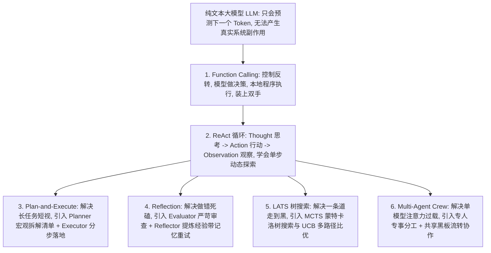
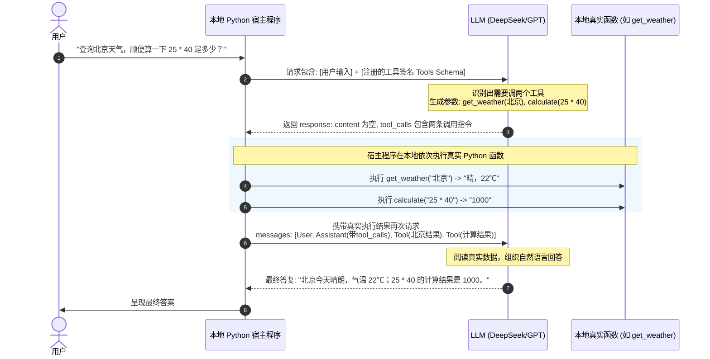
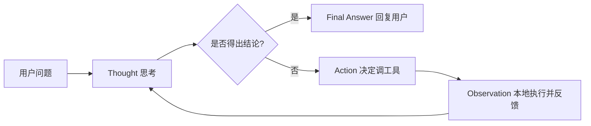
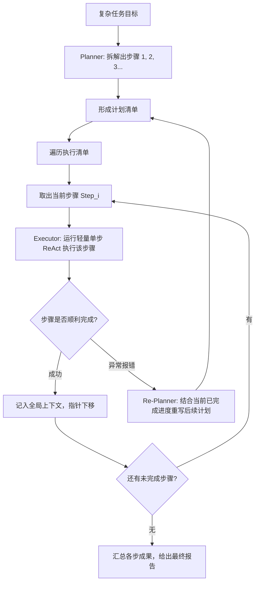
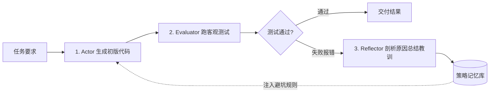
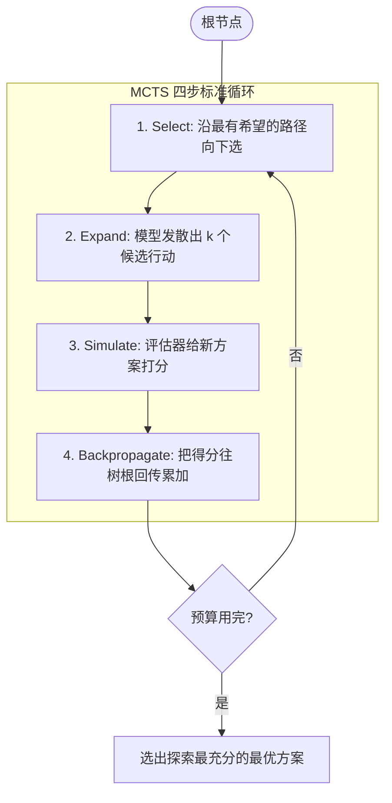
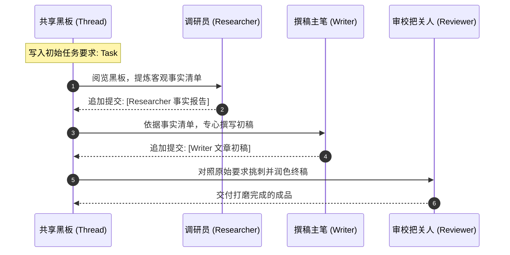

# 01-Agent：从函数调用到多智能体协作全景解析

> **本篇对应 GitHub 源码**：`01-Agent/`  
> **涵盖原生子模块**：`00-llm_function_call`、`01-small-llm-function-call-project`、`02-Agent_react`、`02-Plan-and-Execute`、`03-Reflection`、`04-LATS`、`05-Multi-Agent-Crew`  
> **导读**：  
> 本篇是整个 AI Agent 体系的基石篇。大模型本身只是一个无状态的概率文本续写器，为了让它拥有“解决复杂实际问题”的能力，我们需要一步步为它装上外部工具、单步探索主循环、长任务规划器、自我纠错反思、树状最优决策，以及多角色协同流水线。本篇将每个子模块的来龙去脉、架构设计、核心代码与运行流程彻底讲透。

---

## 零、心智模型：大模型是如何演进为 Agent 的？

在深入代码之前，我们先理清一张核心架构演进图：



---

## 一、`00-llm_function_call`：工具调用的底层机制与协议交互

### 1. 核心痛点与控制反转（Inversion of Control）
很多人刚接触 Agent 时会误以为：“大模型自己在云端服务器上运行了我的 Python 脚本”。**这是完全错误的理解。**

- **大模型的能力边界**：它只能输出文本（或者符合 JSON 格式的字符串），它既没有操作系统权限，也没有网络连接去查实时天气，更算不清 20 位的大数乘除；
- **控制反转的本质**：
  > **通俗比喻**：大模型就像一位“军师”。军师足智多谋，但他不拿刀上战场。  
  > 当你说“帮我查北京今天气温”，军师判断后把锦囊递给你（输出 JSON 参数：`{"name": "get_weather", "arguments": "{\"city\": \"北京\"}"}`）。  
  > 真正动手去网络 API 查天气的是你的本地宿主程序（先锋官）。先锋官查到“22℃，晴”后，把结果呈递给军师。军师阅读客观事实后，再整理成流畅的自然语言回答你。

---

### 2. 双轮通信时序图
一次完整的 Function Calling 包含**两次向大模型的请求 + 一次本地工具执行**：



---

### 3. 核心代码实现

在原项目 `00-llm_function_call.py` 中，定义了三类常用工具：获取当前时间 `get_current_date`、查询天气 `get_weather`、数学计算 `calculate`。

```python
import json
from openai import OpenAI

# 1. 本地真实函数与分发字典
def get_weather(city: str) -> str:
    mock_data = {"北京": "晴，22℃", "上海": "小雨，19℃"}
    return mock_data.get(city, f"{city}天气晴朗，气温 20℃")

def calculate(expression: str) -> str:
    try:
        return str(eval(expression, {"__builtins__": None}, {}))
    except Exception as e:
        return f"Error: {e}"

TOOL_HANDLERS = {
    "get_weather": get_weather,
    "calculate": calculate
}

# 2. 用 JSON Schema 告诉大模型工具有什么用、需要什么参数
TOOLS_SCHEMA = [
    {
        "type": "function",
        "function": {
            "name": "get_weather",
            "description": "查询指定城市的天气状况",
            "parameters": {
                "type": "object",
                "properties": {
                    "city": {"type": "string", "description": "城市名称，如北京、上海"}
                },
                "required": ["city"]
            }
        }
    },
    {
        "type": "function",
        "function": {
            "name": "calculate",
            "description": "计算数学算术表达式",
            "parameters": {
                "type": "object",
                "properties": {
                    "expression": {"type": "string", "description": "数学表达式，如 25 * 40"}
                },
                "required": ["expression"]
            }
        }
    }
]

# 3. 完整的双轮交互闭环
def run_function_calling_demo(query: str, client: OpenAI):
    messages = [
        {"role": "system", "content": "你是一个严谨的助手，请在必要时调用工具获取准确信息。"},
        {"role": "user", "content": query}
    ]

    # 第 1 轮：让大模型决定是否调用工具
    response = client.chat.completions.create(
        model="deepseek-chat",
        messages=messages,
        tools=TOOLS_SCHEMA
    )
    msg = response.choices[0].message

    # 如果不需要调用工具，直接返回文本答案
    if not msg.tool_calls:
        return msg.content

    # 关键点 1：必须先将 assistant 的工具调用意图追加到历史记录中
    messages.append(msg)

    # 关键点 2：遍历每个 tool_call，在本地运行真实函数
    for tc in msg.tool_calls:
        fn_name = tc.function.name
        fn_args = json.loads(tc.function.arguments)
        print(f"[Tool Call] 触发本地函数: {fn_name}, 参数: {fn_args}")

        handler = TOOL_HANDLERS.get(fn_name)
        result_str = handler(**fn_args) if handler else f"Error: 工具 {fn_name} 未实现"

        # 关键点 3：必须使用 role: 'tool' 回填结果，并带上唯一的 tool_call_id
        messages.append({
            "role": "tool",
            "tool_call_id": tc.id,
            "content": str(result_str)
        })

    # 第 2 轮：携带完整的工具执行结果，让大模型生成最终自然语言答案
    final_response = client.chat.completions.create(
        model="deepseek-chat",
        messages=messages
    )
    return final_response.choices[0].message.content
```

> **避坑要点**：  
> 现代模型支持**并行工具调用（Parallel Tool Calls）**。模型一次性返回多个 `tool_call` 项时，回填时必须通过每一个 `tc.id` 与上一步一一对齐，否则 API 会抛出 400 格式错误。

---

## 二、`01-small-llm-function-call-project`：工程化分层设计

在原型验证后，原项目在 `01-small-llm-function-call-project` 中进一步展示了如何将代码组织为可维护的工程结构：
1. **`tools/` 目录**：每个工具拥有独立的文件（如 `weather.py`, `calculator.py`），通过注册器模式解耦；
2. **`schemas/` 目录**：将 JSON Schema 与函数实现分离，方便版本管理与多模型适配；
3. **参数强类型校验**：在 `json.loads` 外部包裹 `pydantic` 模型校验，防止大模型参数拼写漂移导致的运行时崩溃。

---

## 三、`02-Agent_react`：经典 ReAct 思考与行动主循环

单次 Function Calling 只能解决“查一次答一次”的场景。如果遇到复合任务（例如：“*查一下北京现在几点，再计算当前小时数乘 12 是多少*”），模型就必须学会**走一步看一步**。这就是经典著名的 **ReAct 范式**。

### 1. 核心思想：Thought $\rightarrow$ Action $\rightarrow$ Observation
ReAct 由普林斯顿大学提出，核心理念是让大模型模拟人类侦探办案的逻辑：
- **Thought（思考）**：大模型的内心独白，分析当前现状与下一步打算；
- **Action（行动）**：决定调用哪个具体工具；
- **Observation（观察）**：本地程序执行该工具后，把结果喂给大模型观察；
- **Final Answer（最终答案）**：反复多轮后，当收集到全部所需信息，输出最终答案并跳出循环。



---

### 2. 核心源码解析（`agent/loop.py` & `agent/prompt.py`）

#### (1) 提示词模板规约
```text
尽你所能回答用户的问题。你可以使用以下工具：
- calculator: 用于数学计算，输入为算术表达式字符串，如 "12 * 8"
- get_current_time: 获取指定时区的当前时间，输入为时区名，如 "Asia/Shanghai"

请严格按照以下格式回答：
Question: 用户的问题
Thought: 思考你当前需要做什么，分析已知信息与未知信息
Action: 调用的工具名称（必须是上述工具之一）
Action Input: 传入工具的参数字符串
Observation: 工具执行后的返回结果
...（上述 Thought/Action/Action Input/Observation 可以按需重复多轮）
Thought: 我现在已经知道最终答案了
Final Answer: 对原始问题的最终完整回答

开始！
Question: {question}
{history}
```

#### (2) ReAct 控制循环执行器
```python
import re

MAX_STEPS = 5

def react_loop(question: str, tools: dict, llm_client):
    history = ""
    
    for step in range(MAX_STEPS):
        # 1. 组装 Prompt
        prompt = build_react_prompt(question, history)
        
        # 2. 调用大模型，设置 stop 为 "Observation:" 防止模型自我脑补观察结果
        response = llm_client.predict(prompt, stop=["Observation:"])
        print(f"\n--- [第 {step + 1} 步输出] ---\n{response}")
        
        # 3. 检查是否得出最终答案
        if "Final Answer:" in response:
            return response.split("Final Answer:")[-1].strip()
            
        # 4. 正则解析调用的工具与参数
        action_match = re.search(r"Action:\s*(\w+)", response)
        input_match = re.search(r"Action Input:\s*(.+)", response)
        
        if not action_match or not input_match:
            # 格式解析失败时，引导模型重新格式化
            history += f"{response}\nObservation: 格式错误！请严格输出 Action 和 Action Input。\n"
            continue
            
        tool_name = action_match.group(1).strip()
        tool_input = input_match.group(1).strip()
        
        # 5. 本地执行工具并获取观察结果
        if tool_name in tools:
            obs = tools[tool_name](tool_input)
        else:
            obs = f"错误: 未知工具 '{tool_name}'"
            
        print(f">> [Observation 观察]: {obs}")
        
        # 6. 将本轮的思考和观察合并记入历史，进入下一轮
        history += f"{response}\nObservation: {obs}\n"
        
    return "已达最大循环轮数，未能完成任务。"
```

---

## 四、`02-Plan-and-Execute`：显式规划与分步执行

### 1. 核心痛点：ReAct 为什么会“短视”？
ReAct 走一步看一步。面对需要 6~10 步的长链路任务时，很容易出现：
- **目标漂移**：执行到第 5 步时，忘了最开始的宏观任务要求；
- **局部死循环**：在某个小格式问题上重复调用同一个工具多次；
- **上下文膨胀**：每一轮的中间观察结果全塞在历史里，导致上下文 Token 迅速耗尽。

### 2. 解决思路：Planner（架构师）+ Executor（执行者）

> **通俗比喻**：  
> - **Planner（架构师）**：不动手干脏活，负责一眼看穿全局，把任务拆分为 3~5 个有序步骤（如 `["1. 下载文件", "2. 提取文本", "3. 统计字数"]`）；  
> - **Executor（程序员）**：拿着清单逐个落实，只关注当前眼前这一个步骤，上下文极其干净；  
> - **Re-planner（动态重规划）**：万一中间某一步失败（比如链接 404），结合当前已完成成果，重新调整后续剩余步骤。



---

### 3. 核心代码实现（`agent/planner.py`）

```python
import json

class PlanAndExecuteAgent:
    def __init__(self, llm_client, tools: dict):
        self.llm = llm_client
        self.tools = tools

    def create_plan(self, goal: str) -> list[str]:
        """Planner: 一次性分解任务步骤"""
        prompt = f"""请将以下任务分解为 3 到 5 个明确有序的执行步骤。
以纯 JSON 字符串数组格式返回，例如：["步骤1描述", "步骤2描述", "步骤3描述"]。
任务内容：{goal}"""
        raw = self.llm.predict(prompt)
        return json.loads(raw)

    def execute_step(self, step_desc: str, context: dict) -> str:
        """Executor: 单步执行器，只注入与当前步骤相关的上下文"""
        ctx_summary = "\n".join([f"- {k}: {v}" for k, v in context.items()])
        prompt = f"已知进展：\n{ctx_summary}\n\n请执行当前具体步骤：{step_desc}"
        return self.llm.predict_with_tools(prompt, self.tools)

    def run(self, goal: str):
        plan = self.create_plan(goal)
        print(f">> [初始计划清单]: {plan}")
        context = {}
        
        i = 0
        while i < len(plan):
            current_step = plan[i]
            print(f">> [正在执行步骤 {i+1}]: {current_step}")
            
            try:
                res = self.execute_step(current_step, context)
                context[f"步骤_{i+1}"] = res
                i += 1
            except Exception as e:
                print(f"[!] 步骤执行受阻: {e}，触发动态重规划！")
                replan_prompt = f"""原目标：{goal}
已完成成果：{context}
失败步骤：{current_step}（原因：{e}）
请结合当前真实进度，重新规划后续剩余步骤，以 JSON 字符串数组输出："""
                plan = json.loads(self.llm.predict(replan_prompt))
                i = 0 # 重置指针，执行新计划
                
        # 汇总最终报告
        final_prompt = f"任务：{goal}\n各步骤执行结果：{context}\n请为用户生成最终答复："
        return self.llm.predict(final_prompt)
```

---

## 五、`03-Reflection`：失败自愈与策略记忆

### 1. 核心痛点：为什么盲目重试没有用？
要求大模型编写严格格式的代码或复杂业务逻辑时，如果第一次生成的代码有 Bug，普通的“盲目重试”往往会导致模型在同一个逻辑漏洞上反复跌倒。

### 2. 解决思路：自我批判与策略沉淀
`03-Reflection` 引入了审查与反思机制：
1. **Actor（干活者）**：生成初版代码；
2. **Evaluator（质量审查员）**：跑真正的单元测试，给出真实报错；
3. **Reflector（复盘反思员）**：分析报错原因，提炼出 1~2 条明确的避坑准则；
4. **带策略记忆重试**：把反思出的规则置顶加入下一次的 Prompt 中，模型就像吸取了教训的老程序员一样顺利改好代码。



---

### 3. 核心代码实现

```python
MAX_RETRIES = 3

def reflection_loop(task_prompt: str, code_tester_func, llm_client):
    reflections = []  # 策略记忆池
    
    for attempt in range(1, MAX_RETRIES + 1):
        # 1. 组装输入：将前期积累的失败教训完整注入
        memory_str = "\n".join([f"- 规则 {i+1}: {r}" for i, r in enumerate(reflections)])
        prompt = f"""任务要求：{task_prompt}
【前期失败反思教训（务必严格遵守）】：
{memory_str}

请给出完整实现方案："""
        
        # 2. Actor 产生方案
        code = llm_client.predict(prompt)
        
        # 3. Evaluator 跑客观测试
        passed, error_log = code_tester_func(code)
        if passed:
            print(f"[✓] 第 {attempt} 轮顺利通过测试！")
            return code
            
        # 4. Reflector 剖析原因，提炼准则
        print(f"[✗] 第 {attempt} 轮失败，报错：{error_log}")
        reflect_prompt = f"""你写的代码未能通过测试：
代码：\n{code}
报错信息：\n{error_log}

请分析造成该错误的根本原因，并总结 1 条简洁明确的改进指导准则（不要写完整代码，只写经验规则）："""
        critique = llm_client.predict(reflect_prompt)
        print(f"[💡 提炼教训]: {critique}")
        reflections.append(critique)
        
    return f"超出最大尝试轮数，未完全通过。最新代码为：\n{code}"
```

---

## 六、`04-LATS`：语言智能体树搜索（MCTS）

### 1. 核心思想：多方案比选，不一条道走到黑
- ReAct 是“单链往前冲”，Reflection 是“撞墙后退一步再试”；
- 但在面临多步博弈、架构方案选型或复杂数学谜题时，每一步都有很多分支可选。一旦前两步选错，后续所有代价都会白费；
- **LATS（Language Agent Tree Search）** 借鉴了 AlphaGo 下围棋的蒙特卡洛树搜索（MCTS）思想：**把中间状态视作树的节点，把行动视作树枝，在树上多路径比选最优解**。



### 2. MCTS 四步控制流通俗解析
1. **Select（选择）**：从根开始，根据 **UCB 公式** 选择最有潜力的子节点往下走。
   - **UCB 的通俗含义**：既偏向“之前得分很高的分支”（利用老经验），又给“尝试次数很少的分支”额外加分（探索新路线），实现**探索与利用的动态平衡**；
2. **Expand（展开）**：让大模型一次性发散出 3 个完全不同的备选行动；
3. **Simulate / Score（评估）**：评估器（Scorer）给新分支打一个潜力分（0.0 ~ 1.0）；
4. **Backpropagate（回溯）**：把这个分数顺着选取的路线一路回传给父节点，更新它们的访问频次与总分；
5. 预算耗尽后，选出探索最充分、均值最高的一条路作为最终决策。

---

## 七、`05-Multi-Agent-Crew`：多角色流水线与共享黑板

### 1. 核心思想：专人专事 + 共享黑板
如果把一篇文章从搜集资料、拟定大纲、撰写正文到严苛挑错，全塞给同一个 Agent，大模型容易“人格分裂”，顾此失彼。

`05-Multi-Agent-Crew` 采用团队流水线模式：
- **Researcher（调研员）**：只负责梳理客观事实清单；
- **Writer（主笔）**：依据事实清单，专心撰写文章正文；
- **Reviewer（审稿编辑）**：对照原始要求挑刺找茬，并直接打磨输出最终定稿；
- **共享黑板（Thread）**：大家共看同一份对话记录，依次认领任务并在黑板末尾追加成果。



---

### 2. 核心代码实现（`agent/crew.py`）

```python
ROLES = {
    "researcher": "你是一名严谨的研究员。请从任务中提炼出核心事实点、背景要素，输出客观事实清单。",
    "writer": "你是一名专业作者。请根据研究员提供的事实清单撰写连贯、专业的初稿，严禁无中生有。",
    "reviewer": "你是一名资深审校。请挑出初稿中的逻辑漏洞与多余字句，直接输出打磨完成的最终定稿。"
}

def run_crew(task: str, llm_client, rounds: int = 1) -> str:
    # 1. 建立共享黑板 Thread
    thread = f"【全局任务目标】\n{task}\n"
    pipeline = ["researcher", "writer", "reviewer"]
    
    for r in range(rounds):
        for role in pipeline:
            # 2. 把当前黑板全文作为上下文喂给当前角色
            prompt = f"{thread}\n\n当前轮到你工作。请以 [{role}] 的身份展开本轮工作："
            output = llm_client.predict(prompt, system=ROLES[role])
            
            # 3. 将产出追加在黑板末尾
            thread += f"\n--- [{role} 发言 (第 {r+1} 轮)] ---\n{output}\n"
            print(f"[+] 角色 [{role}] 提交成果至黑板。")
            
    return thread
```

---

## 八、全章核心范式横向对比速查表

| 范式名称 | 核心驱动思路 | 解决什么问题 | 典型适用场景 |
| :--- | :--- | :--- | :--- |
| **ReAct** | 单链逐步推理 + 实时调工具 | 走一步看一步，具备动态探索适应能力 | 路径不确定、依赖外部即时反馈的任务 |
| **Plan-and-Execute** | 显式先出计划清单 $\rightarrow$ 分步执行 | 治愈单链“短视”，步骤清晰可审计 | 步骤多、流程明确的长链路任务 |
| **Reflection** | 严苛测试 $\rightarrow$ 反思失败 $\rightarrow$ 带经验重试 | 解决做错后盲目重试依然报错的死穴 | 代码编写、复杂数学推导、特定格式输出 |
| **LATS (树搜索)** | MCTS 在多分支决策树上搜索 | 解决早期决策选错后全盘皆输的问题 | 规划 puzzle、算法调优、多方案比选决策 |
| **Multi-Agent** | 角色各司其职 + 共享黑板流转 | 解决单模型注意力分散、角色冲突问题 | 内容流水线、协同代码审查、复杂调研报告 |

---

## 本篇小结

1. **工具调用是地基**：大模型负责出谋划策并打包参数，本地程序负责安全执行，`tool_call_id` 是防止数据串线的唯一标尺；
2. **ReAct 是最经典的循环**：通过 Thought $\rightarrow$ Action $\rightarrow$ Observation，大模型学会了在未知环境中自发探索；
3. **针对痛点打补丁**：
   - 步数太长容易迷路？用 **Plan-and-Execute** 拆步骤清单；
   - 代码做错反复摔倒？用 **Reflection** 反思教训带记忆重试；
   - 决策复杂怕选错？用 **LATS 树搜索** 多路径比选；
   - 任务繁重角色冲突？用 **Multi-Agent Crew** 团队流水线分工合作；
4. **下一篇预告**：Agent 已经具备了思考和行动的能力，但如果它需要海量的专业私有知识库做支撑，该如何搭建？下一篇进入 **02-RAG：检索增强生成与知识库架构**！
