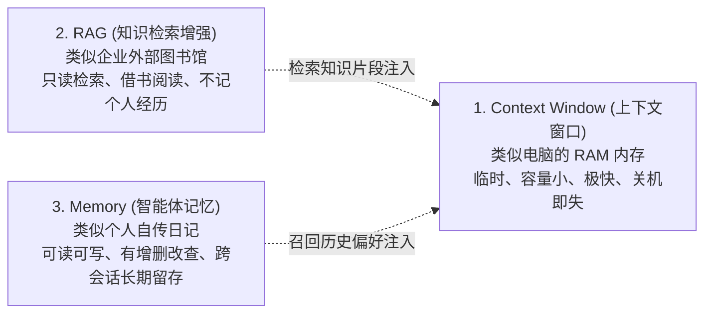
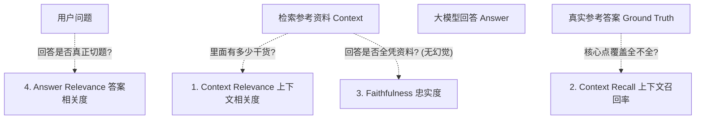

# 02-RAG：检索增强生成与知识库全栈架构

> **本篇对应 GitHub 源码**：`02-RAG/` 与 `99-My idea/`  
> **涵盖原生子模块**：`01-simple_rag`、`02-RAG_basic`、`03-high_level_RAG`（GraphRAG / Self-RAG / CRAG / Adaptive RAG）、`04_RAG_Evaluation`（Ragas 评测）、`05_PDF_process`、`06 Agentic RAG`  
> **导读**：  
> 很多开发者刚做 RAG 时，只是“把文本向量化存进数据库，用户问了就取相似度前 3 条塞给大模型”，结果一上线就遭遇“复读机”、“搜出无关废话”、“依然产生严重幻觉”三大死穴。本篇从根本上厘清 Context Window、RAG 与 Memory 的边界，详解数据切块与向量加速，深入剖析工业级“三步走高精检索流水线”，以及高阶自省架构与量化评测体系。

---

## 零、概念辨析：Context Window vs RAG vs Memory

在深入工程之前，必须先纠正很多人的概念混淆。在 `99-My idea` 中，作者对三者的本质边界做了精辟的划分：



- **RAG 是只读的外部知识供给**：它解决的是“大模型不知道我们公司的请假规范、产品报价”的问题；
- **Memory 是可读写的自身经历沉淀**：它解决的是“大模型记不住昨天我和它达成了什么约定”的问题；
- **Context Window 是当前时刻的工作台**：把 RAG 借来的书和 Memory 翻出的日记，一起摆在桌面上供大模型思考。

---

## 一、`01-simple_rag` & `02-RAG_basic`：数据切块与向量库基石

很多团队做 RAG 效果差，排查到最后往往不是大模型不够聪明，而是**前期数据入库做得太粗糙**。

### 1. 为什么不能整篇万字长文直接存入？
- **窗口与成本限制**：长文一口气塞进去极其昂贵，而且长文本会导致“中间信息迷失”（Lost in the Middle）；
- **语义稀释**：一篇文章讲了 5 个不同的话题，生成的向量是这 5 个话题的“平均折中”，检索时缺乏明确焦点。

---

### 2. 滑动窗口切块与 10% Overlap（重叠步长）
通常把文本切成 **300~500 字符** 的小块，但切分时千万不能机械一刀切！

> **通俗比喻**：  
> 如果一句话正好在切分点被拦腰截断：“*...违反上述规定的员工，[切断] 将被扣除当月全部绩效奖金。*”  
> 如果没有重叠，前面一块不知道处罚是什么，后面一块不知道因为什么被罚！  
> **保留 10%~15% 的重叠区域（Overlap）**，就是让相邻两个文本块有几十个字的重合，确保关键句子在某一块里完整保留。

```
[原始长文本流] ----------------------------------------------------
块 1: [第 1 字 ----------------- 第 400 字]
               └── (重叠 40 字) ──┤
块 2:         [第 360 字 ----------------- 第 760 字]
```

---

### 3. 向量化（Embedding）与 Faiss 加速技巧
- **嵌入模型（Embedding Model）**：负责把一段文字转化成一串长长的数组（如 768 维高维向量）；
- **语义空间几何**：在数学空间里，“如何请年假”和“带薪休假申请指引”，虽然字面上完全不同，但转化为向量后，它们彼此挨得极近（余弦相似度极高）。

#### 工程加速秘籍：L2 归一化让内积等价于余弦
余弦相似度的分母需要计算两个向量的模长乘积。如果每次在线检索都要对几十万个向量动态开根号做除法，CPU/GPU 计算代价极高。  
- **离线入库前**：对所有文档向量执行模长归一化（模长严格为 1）；
- **在线查询前**：对用户问题向量也执行模长归一化；
- **此时分母恒等于 1**，余弦相似度直接简化为**极速矩阵点乘内积（`IndexFlatIP` 索引）**，检索吞吐量成倍飙升！

```python
import faiss
import numpy as np

dimension = 768
index = faiss.IndexFlatIP(dimension)

# 模拟切好的文档向量 (N, 768)
doc_vectors = np.random.randn(500, dimension).astype('float32')

# 关键：L2 模长归一化
faiss.normalize_L2(doc_vectors)
index.add(doc_vectors)
print(f"成功构建本地向量知识库，文档块总数: {index.ntotal}")
```

---

## 二、`03-high_level_RAG`：工业级“三步走”高精检索流水线

### 1. 初级检索的死穴：复读机效应
单纯依赖余弦相似度取 Top-K，最容易搜出一堆**同源转载的重复内容**：
- 搜索“新能源免税政策有何变化”，搜出来的 5 段话全是各家媒体互相抄袭的新华社通稿第一句；
- 大模型的上下文全被复读机占满，根本看不到政策细则、执行时间等其他维度的内容。

### 2. 工业级三步走流水线架构

```
[全库海量文档]
     │
     ▼ Step 1: 粗筛 (大网捕鱼，速度极快)
  Bi-Encoder 向量检索 ──► 捞出 Top-50 篇候选
     │
     ▼ Step 2: 多样化挑选 (踢掉复读机)
  MMR 循环挑选 ──► 选出 10 篇角度各不相同的优质候选
     │
     ▼ Step 3: 精排打分 (极致精度)
  Cross-Encoder 交叉注意力 ──► 深度把脉，挑出最终 Top-3 喂给大模型
```

#### Step 1：Bi-Encoder 粗筛（快！）
- 问题和文章分开独立算向量；
- 只需要在 Faiss 里跑毫秒级的矩阵点乘，先从几十万篇资料里网罗出 50 篇沾边的候选。

#### Step 2：MMR 多样化（去水果摊挑水果理论）
**MMR（最大边际相关性）** 专治复读机！

> **通俗比喻**：  
> 你去水果摊跟老板说：“给我挑一篮好吃的水果”。  
> - **普通挑选**：老板看你喜欢甜的，唰唰给你拿了 5 个一模一样的大红富士苹果。你吃饱了全是苹果味，吃不到香蕉也吃不到橙子。  
> - **MMR 挑选**：既要切合口味，种类又得丰富！  
>   - 第 1 轮：挑一个最切题的（大红富士）；  
>   - 第 2 轮：既要甜，又不能太像苹果（选一根甜香蕉）；  
>   - 第 3 轮：既要甜，还要避开苹果和香蕉（选一串葡萄）...  
>   - 最终选出一篮风味丰富的好水果！

- **$\lambda$ 调节旋钮**：MMR 公式中的 $\lambda$ 是平衡开关，通常设为 **0.5~0.6**，在“切题度”与“内容丰富度”之间找到最佳平衡。

#### Step 3：Cross-Encoder 精排（老中医戴老花镜把脉）
通过 MMR 挑出了 10 篇角度各异的好文章后，该请出重排模型 **Cross-Encoder**：
- **原理**：把 `[问题, 文档]` 拼在一起喂给模型，文字之间做全量自注意力计算；
- **精度极高**：能够明察秋毫地分辨出否定句、细微条件限制等逻辑细节；
- **算力刚刚好**：全库跑它算不起，但只给选出来的 10 篇精细打分只需几毫秒，最后选出无可挑剔的 **Top-3** 送入大模型。

---

## 三、`03-high_level_RAG`：高级架构五大范式

原项目 `03-high_level_RAG` 针对复杂场景提供了五大独立高级范式：

| 范式文件 | 核心思路 | 与普通 RAG 的根本区别 | 适用典型场景 |
| :--- | :--- | :--- | :--- |
| **`01-graph_rag.py`** | 实体抽取 + 知识图谱子图检索 | 沿实体关系边做多跳（Multi-Hop）关联推理 | 金融股权穿透、医疗疾病并发症关联 |
| **`02-agentic_rag.py`** | 将检索封装为工具，由 Agent 决定 | 检索几次、用什么关键词由智能体动态决策 | 深度调研报告生成、跨多个数据库对比 |
| **`03-self_rag.py`** | 全流程自省标记（Critique Tokens） | 生成前自省“要不要搜”、检索后自省“文档切不切题”、生成后自省“是否有依据” | 严谨学术问答、合规政策审查 |
| **`04-corrective_rag.py`** | 检索评估 $\rightarrow$ 动态纠正改写 | 检索质量不达标时，主动改写查询词并调用外部搜索补充证据 | 内部知识库冷门/残缺内容补全 |
| **`05-adaptive_rag.py`** | 动态语义分类与路由分级 | 简单直白问题直接由大模型答；普通问题单跳检索；复杂问题多步检索 | 高并发生产平台，节约算力与成本 |

---

## 四、`04_RAG_Evaluation`：Ragas 四维客观评测体系

怎么科学衡量 RAG 系统的优化效果？开源评测框架 **Ragas** 提出了四个最核心的量化标尺：



1. **Context Relevance（上下文相关度）**：搜出来的资料里，有用的干货占多大比例？（惩罚搜出一堆废话）；
2. **Context Recall（上下文召回率）**：标准答案所需的事实点，在搜出来的资料里全不全？
3. **Faithfulness（忠实度 —— 防幻觉的核心指标）**：模型的回答里，每一句话能不能在参考资料里找到依据？**只要资料里没写、模型自己脑补的，该项直接扣分**；
4. **Answer Relevance（答案相关度）**：回答有没有答非所问，是否切中用户的问题痛点。

---

## 本篇小结

1. **明确三者边界**：Context Window 是 RAM 内存，RAG 是外部只读图书馆，Memory 是长期个人日记；
2. **切块要有 Overlap**：300~500 字一块，保留 10% 重叠，防止关键句子断章取义；
3. **三步走高精检索流水线**：
   - **Bi-Encoder** 粗筛（网大捞鱼快，捞出 Top-50）；
   - **MMR 挑选**（水果摊理论，去重，选出角度不同的 Top-10）；
   - **Cross-Encoder 精排**（老中医把脉，高精打分，选出 Top-3）；
4. **科学评测以 Ragas 为标尺**：用“忠实度”和“相关度”指标量化调优，告别肉眼盲测；
5. **下一篇预告**：有了强大的外部检索知识库，Agent 如何在长时间多轮对话中记住用户的习惯和偏好？下一篇进入 **03-Memory：分层会话记忆与三因子遗忘打分**！
