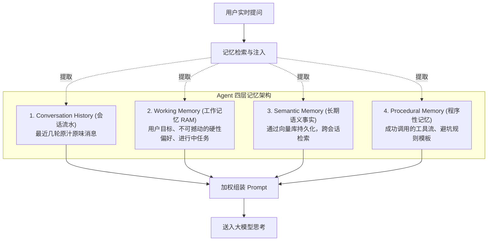
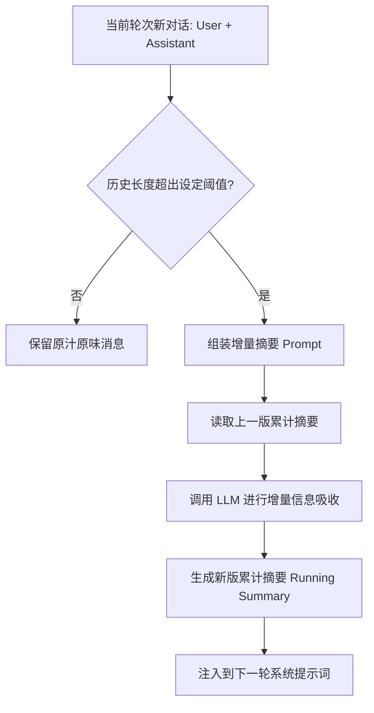
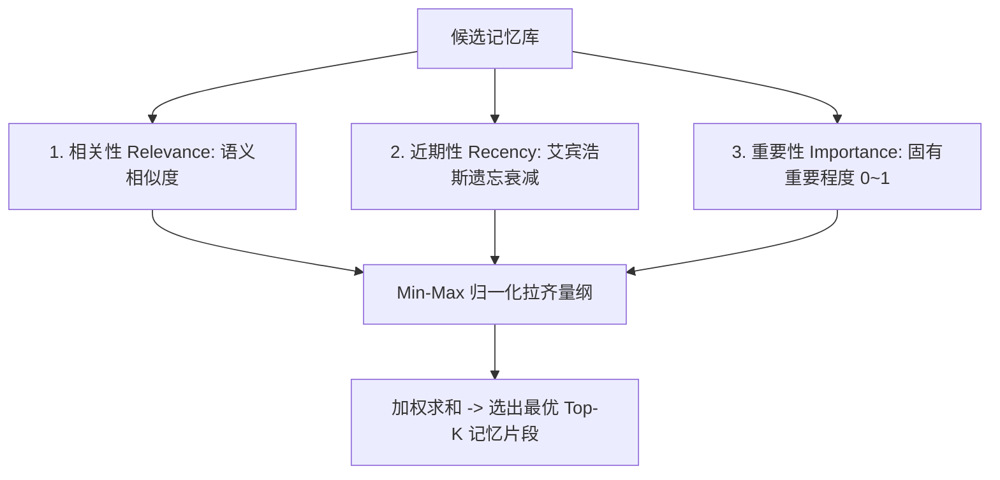

# 03-Memory：分层会话记忆与三因子遗忘打分

> **本篇对应 GitHub 源码**：`03-memory/` 与 `99-My idea/`  
> **涵盖原生子模块**：`01-windowed_memory`、`02_long_term_memory`、`03_summary_memory`、`04_three_factor_scoring`、以及 `99-My idea` 中的 Memory 深度架构  
> **导读**：  
> 大模型是“无状态”的，关掉窗口它就忘了你是谁。很多开发者只知道把历史拼接在 Prompt 里，导致遭遇“上下文腐化（Context Rot）”和 Token 费用失控。本篇结合 GitHub 源码与作者的核心思路，深入拆解四层 Agent 记忆架构、防摘要丢失方案，并重点剖析斯坦福虚拟小镇经典的**三因子（相关性、近期性、重要性）遗忘打分算法**。

---

## 零、心智模型：为什么不能只靠 Prompt 拼接历史？

大模型单次交互的 Context Window 是宝贵而昂贵的资源：
- **Smart Zone 与 Dumb Zone（聪明区与笨蛋区）**：  
  在会话早期（0~100K Token），大模型的推理注意力极其集中敏锐（Smart Zone）；当无脑拼接了 50 轮历史、Token 逼近 100K~200K 时，模型会发生“上下文腐化（Context Rot）”，对早期设定的核心规则视而不见，进入逻辑混乱的 Dumb Zone；
- **Momento 遗忘效应**：一旦开启新会话线程，模型状态归零。

因此，工业级 Agent 必须拥有**分层递进的记忆管理系统**：



---

## 一、短期与压缩记忆实现机制

### 1. `01-windowed_memory` —— 滑动窗口记忆
- **原理**：只保留最近 $K$ 轮原话（例如最近 5 轮），更早的消息直接丢弃；
- **优缺点**：零额外调用成本，实现极简；但早期约定会直接“失忆”。

---

### 2. `03_summary_memory` —— 运行摘要记忆（Running Summary）
为了解决长会话丢失主线的问题，引入大模型做**渐进式滚雪球压缩**：



#### 如何解决“长对话摘要丢失关键信息”？
在 `99-My idea/memory/04.memory.md` 中，作者指出了单纯做摘要的痛点：大模型做摘要时，容易把用户的核心硬性要求（如“我坚决不要用中文回答”、“我对花生严重过敏”）当成普通细节压缩掉！  
**解法方案**：
1. **前置固定关键信息到 Working Memory**：将用户的核心偏好、禁忌词抽取后置顶固化在系统提示词中，**不参与摘要压缩**；
2. **结构化分层摘要**：摘要不仅仅是一段话，而是分为三栏：`【当前目标】`、`【已定结论】`、`【待办事项】`。

---

## 二、`02_long_term_memory`：长期向量记忆

- **原理**：将用户在长程对话中展现的关键偏好事实提取出来，转化为向量，写入向量数据库持久化存储；
- **跨会话唤醒**：当下一周开启全新的聊天窗口时，只要提问涉及相关内容，系统即可通过向量相似度将该事实翻出来注入当前上下文。

---

## 三、`04_three_factor_scoring`：斯坦福三因子遗忘打分算法

当你在向量库里累积了上百条关于用户的记忆时，如果仅仅根据“语义像不像（向量相似度）”来检索，往往会翻出很久以前的一句过时废话。

斯坦福大学在著名论文《Generative Agents（虚拟小镇）》中提出了划时代的**三因子打分排序算法（Three-Factor Scoring）**。

### 1. 三大因子的数学逻辑与通俗大白话

$$\text{综合得分} = w_{\text{rel}} \cdot \text{相关性} + w_{\text{rec}} \cdot \text{近期性} + w_{\text{imp}} \cdot \text{重要性}$$



1. **相关性（Relevance）**：记忆片段与当前问题的语义相似度（向量余弦相似度）；
2. **近期性（Recency —— 艾宾浩斯遗忘曲线）**：  
   刚发生的事情记得最清楚，时间越久分值按指数衰减：  
   $$\text{近期分} = \exp(-\text{衰减系数} \times \text{过去的小时数})$$
3. **重要性（Importance）**：  
   有些事情具有不可撼动的价值（比如“*用户对花生严重过敏*”）。哪怕过去了一个月，它的固有分值依然极高，不能被忘掉！

---

### 2. 为什么要 Min-Max 归一化？
- 向量相似度通常在 0.5 到 0.8 之间；
- 指数衰减的近期分在 0 到 1 之间且非常非线性；
- **如果直接相加，不同因子尺度不一，加权系数就失去了意义**。
- 因此，每次在同一批备选记忆里，将最高分映射为 1，最低分映射为 0（Min-Max 归一化），再加权融合求和，结果最稳健。

---

### 3. 核心代码实现（纯 Python 标准库）

```python
import math
import time

def score_memories(memories, relevance_scores, now_time, top_k=2):
    # 1. 归一化相关性得分
    min_r, max_r = min(relevance_scores), max(relevance_scores)
    rel_norm = [(r - min_r) / (max_r - min_r + 1e-5) for r in relevance_scores]

    # 2. 计算并归一化近期性得分（指数遗忘衰减）
    rec_raw = [math.exp(-0.2 * ((now_time - m.timestamp) / 3600)) for m in memories]
    min_rc, max_rc = min(rec_raw), max(rec_raw)
    rec_norm = [(rc - min_rc) / (max_rc - min_rc + 1e-5) for rc in rec_raw]

    # 3. 三因子加权融合 (0.5 相关 + 0.3 近期 + 0.2 重要)
    final_scores = []
    for i, m in enumerate(memories):
        score = 0.5 * rel_norm[i] + 0.3 * rec_norm[i] + 0.2 * m.importance
        final_scores.append((m, score))

    # 按最终综合分降序排序
    final_scores.sort(key=lambda x: x[1], reverse=True)
    return final_scores[:top_k]
```

---

## 本篇小结

1. **摆脱单一 Prompt 拼接**：认清 Smart Zone 与 Context Rot，采用分层记忆架构；
2. **硬约束固化在 Working Memory**：防止长对话增量摘要时丢失用户的关键禁忌和核心目标；
3. **三因子打分算法**：融合**切题度（Relevance）**、**遗忘衰减（Recency）**与**核心重要性（Importance）**，用 Min-Max 归一化对齐，完美模拟了人类大脑的记忆唤醒机制；
4. **访问后刷新时间戳**：某条记忆被召回成功后，刷新其访问时间，模拟大脑中“温故而知新”的生理反馈；
5. **下一篇预告**：有了长久记忆的单智能体越来越聪明，但多智能体之间如何进行通信与协作？下一篇进入 **04-MultiAgent：多智能体协作模式与冲突仲裁**！
