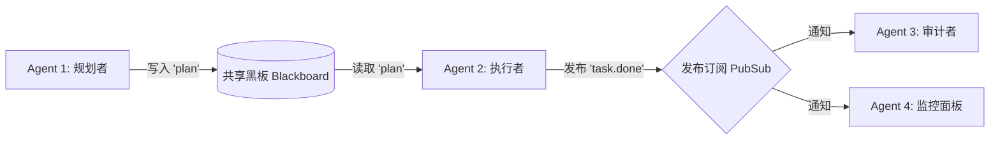

# 04-MultiAgent：多智能体协作模式与冲突仲裁

> **本篇对应 GitHub 源码**：`04-multiagent/` 与 `99-My idea/`  
> **涵盖原生子模块**：`01-single_vs_multi`、`02-blackboard_pubsub`、`03-phase_state_machine`、`04-langgraph_style`、`05-crew_style`、`06-enterprise_deidentify`、`07-run_with_guard`、`09-task_routing`、`10-conflict_resolution`、`11-observability`  
> **导读**：  
> 很多初学者以为“多智能体就是写三五个提示词，让它们在群聊里互相对话”。但在实际工程中，放任大模型自由聊天通常会演变成“无限互相吹捧”，甚至输出质量崩溃。本篇对照 GitHub 源码目录，用通俗直白的大白话讲清楚多智能体系统的**切入边界（三看原则）**、**通信模式（黑板与发布订阅）**、**流水线状态机**、**冲突仲裁机制**与**企业级安全脱敏**。

---

## 一、什么时候必须切入多 Agent？（三看原则）

盲目堆砌 Agent 只会徒增开销和排错难度。根据源码中的 `01-single_vs_multi.py`，只有满足以下三种情况之一，才建议拆分多智能体：

1. **看目标是否天然冲突**：  
   例如“代码编写员（希望尽快交付）”与“代码安全审计员（希望严苛挑刺）”。两者的考核标准完全相反，强行揉在一个 Prompt 里模型会变得中庸妥协，必须拆分；
2. **看工具链是否超载（超过 15 个工具）**：  
   给单个模型塞太多的工具说明，它经常会挑错工具或传错参数；按“数据库组”、“网络搜索组”拆分后各自更专精；
3. **看上下文是否需要硬隔离**：  
   某个子任务有几万字的复杂排查过程，主系统只需要最终的一句排查结论，无需让无关细节污染主上下文。

---

## 二、通信架构：黑板模式与事件广播

多智能体之间如何传话？源码中实现了两大经典通信机制：



- **黑板模式（Blackboard）**：大家围着同一块黑板（共享内存字典或 Redis）工作，Agent 1 负责把方案写在黑板上，Agent 2 接着看黑板继续写；
- **发布订阅（Pub-Sub）**：当某个关键节点完成时，向总线广播一个事件，多个下游 Agent 可以同时异步响应。

```python
import threading
from collections import defaultdict
from typing import Any, Callable, Dict, List

class Blackboard:
    """黑板模式：所有 Agent 读写同一份受保护的全局状态"""
    def __init__(self):
        self._data: Dict[str, Any] = {}
        self._lock = threading.Lock()

    def write(self, key: str, value: Any) -> None:
        with self._lock:
            self._data[key] = value

    def read(self, key: str) -> Any:
        with self._lock:
            return self._data.get(key)
```

---

## 三、控制流规约：有限状态机（防止无休止水群）

多智能体绝不能像普通微信群那样随意发言，必须有严格的**工作阶段（State Machine）**：

```
[PLAN 规划阶段] ──(审批通过)──► [CODE 编码阶段] ──(提交)──► [REVIEW 审查阶段]
                                     ▲                            │
                                     └───(审查不通过，退回返工)───┘
```

每个角色必须在属于自己的阶段登场，一旦 Reviewer 最终敲定 `PASS`，整个流水线立即安全结束。

---

## 四、冲突解决：如果 Agent 们吵架了怎么办？

当多个 Agent 提出的解决方案互斥时，如何决定采纳谁的意见？

| 仲裁机制 | 运作方式 | 优点 | 隐患与风险 |
| :--- | :--- | :--- | :--- |
| **简单多数投票 (Vote)** | 少数服从多数 | 逻辑直观、简单 | 容易被平庸的大多数带偏，发生集体认知偏差 |
| **证据加权投票 (Evidence)** | 投票不仅看人数，更看谁附带的客观证据硬 | 更理性、看事实说话 | 需对证据真实性做可靠打分 |
| **主席一票裁决 (Chair)** | 类似主架构师，审阅各方依据后一人拍板 | 高效、方向明确 | 取决于主席模型的判别水平 |

```python
# 示例：证据加权投票
proposals = [
    {"choice": "REST", "evidence": 0.4},      # 观点A：初级开发 1 (凭感觉)
    {"choice": "REST", "evidence": 0.5},      # 观点A：初级开发 2 (从众)
    {"choice": "gRPC", "evidence": 0.95},     # 观点B：核心架构师 (附严密基准测试数据)
]

# 机制：每票基础分 1.0 + 证据强度
# REST 得分 = (1 + 0.4) + (1 + 0.5) = 2.9
# gRPC 得分 = 1 + 0.95 = 1.95 (如果仅看票数，REST 胜出，产生平庸偏误)
# 若采用“主席裁决”，则直接采信拥有最高证据 (0.95) 的方案，避免被平庸多数绑架！
```

---

## 五、企业级安全脱敏与全链路可观测性

1. **数据去标识化脱敏（De-identify）**：
   - 在将数据发送给外部公网 Agent 前，使用规则或本地小模型将手机号、姓名替换为占位符：`[PHONE_1]`、`[NAME_1]`；
   - 最终呈现给本地用户时，通过映射字典逆向还原。
2. **全链路 Tracing 审计**：
   - 每一个任务赋予唯一的 `Trace ID`；
   - 记录各个 Agent 之间的调用拓扑树（Span），精准统计各环节消耗的 Token 与时延。

---

## 本篇小结

1. **三看原则决定是否切入多体**：看目标是否冲突、看工具是否超载、看上下文是否需要隔离；
2. **通信标准模式**：黑板模式共享状态，发布订阅模式异步解耦；
3. **状态机规范控制流**：分阶段执行，避免死循环和无效聊天；
4. **仲裁消解分歧**：通过证据加权或主席裁决，避免群体平庸偏误；
5. **下一篇预告**：系统功能完善后，外部供应商经常限流 429、网络超时 504 怎么办？下一篇进入 **05-ModelRoute：高可用模型路由与网关工程化**！
