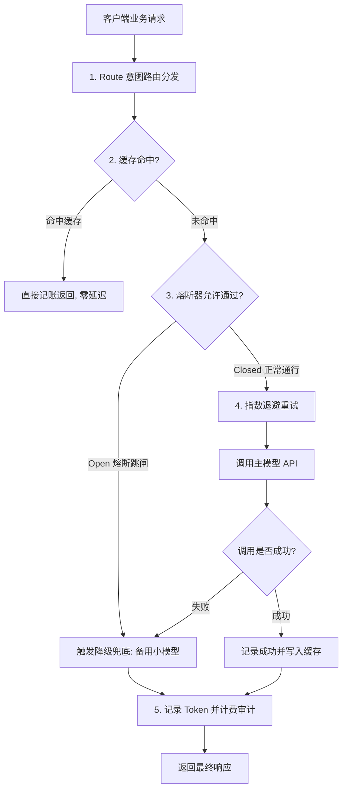
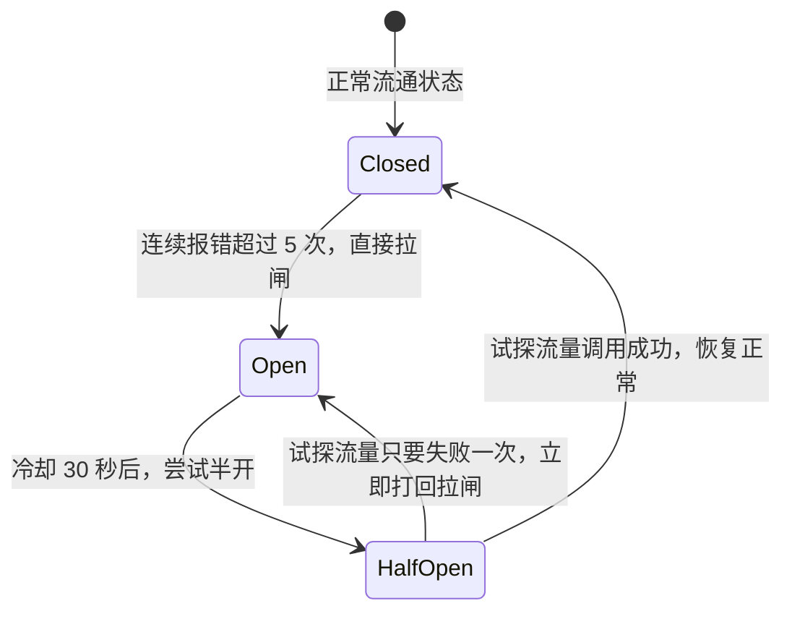

# 05-ModelRoute：高可用模型路由与网关工程化

> **本篇对应 GitHub 源码**：`05-model-route/` 与 `99-My idea/`  
> **涵盖原生子模块**：`01` 熔断退避、`02` 请求指纹缓存、`03` L1/L2 缓存、`05` 全链路闭环、`06` Token 对账、`08` 工具白名单、`09` 金丝雀分流、`10` 语义缓存风险、`11` 幻觉三层治理  
> **导读**：  
> 很多开发者在本地写 Demo 时直接裸调 `client.chat.completions.create` 觉得顺风顺水，但只要一上线，供应商接口限流（429）、网络超时（504）、账单超出预期等问题就会接踵而至。本篇对照 GitHub 源码目录，用通俗直白的大白话带你搞懂如何给大模型应用穿上一层坚固的“工业级高可用护甲”。

---

## 一、篇章总览：为什么生产环境不能“裸调”大模型？

在真实生产环境下，大模型接口有三大不确定性：
1. **网络极其脆弱**：外部供应商机房可能偶发抖动，突发限流报错；
2. **费用极其高昂**：同样的问题被用户反复提问，如果不做缓存就是在白白烧钱；
3. **单点依赖风险**：一旦主力大模型宕机，整个业务系统直接瘫痪。

因此，成熟的 AI 架构必须有一层**网关代理管道（Gateway Pipeline）**：

---

## 二、子模块详解

### 1. `01` 熔断器与指数退避重试

#### (1) 三态熔断器（Circuit Breaker）—— 防雪崩空气开关
熔断器就像家里的空气开关，用来防止外部灾难蔓延到内部系统：

- **Closed（闭合正常）**：流量正常通过；如果短时间连续报错超过阈值，立刻跳闸进入 **Open**；
- **Open（断开阻断）**：直接拦截所有请求，不再向外部发网络包，**毫秒级就地触发备用降级策略（Fallback）**，保护系统不被卡死；
- **Half-Open（半开试探）**：冷却时间过后，只放行一两个请求去试探外部服务是否恢复，好了就恢复闭合，没好继续拉闸。

#### (2) 指数退避重试（带随机抖动 Jitter）
遇到接口报 429（请求太频繁）时：
- **错误做法**：每隔 1 秒死板重试一次，引发“惊群效应”；
- **正确做法**：第 1 次等 1 秒，第 2 次等 2 秒，第 3 次等 4 秒……并且每次加上一点点随机波动（例如 1.2 秒、2.3 秒），把重试时间错开。

---

### 2. `02` & `10` 缓存治理：精确缓存 vs 语义缓存

| 缓存类型 | 原理 | 优点 | 隐患与风险 |
| :--- | :--- | :--- | :--- |
| **精确哈希缓存 (Exact)** | 对输入文本算 SHA256 哈希值，完全一致才命中 | **绝对安全**，绝不串答 | 稍微多一个标点符号就无法命中 |
| **语义缓存 (Semantic)** | 计算提问向量，相似度大于 0.95 判定为命中 | 同义句、轻微变体也能秒级命中，省下大笔 Token | **高危风险**：容易张冠李戴（例如把“取消订单”误命中成了“支付订单”） |

> **工程避坑原则**：  
> 涉及钱、删除、修改、鉴权场景，**必须只用精确哈希缓存**；只有纯科普、长篇只读型解释问答，才考虑开启高阈值的语义缓存。

---

### 3. `06` Token 对账与用量预警

- **为什么本地预估总是不准？**  
  本地用 `tiktoken` 算的是明文 Token，而供应商会自动打包看不见的内部 Prompt 模板与工具 Schema；
- **对账告警**：在响应返回后，将实际消耗与本地预估做比对，当偏差率持续超过 20% 时触发告警，防范隐藏 Prompt 注入或计费劫持。

---

### 4. `08` 工具白名单与权限分层

- **白名单机制**：不是所有模型都可以调用“删库”、“转账”等高危工具；
- **权限分级**：只读查询类工具对所有 Agent 开放，涉及写操作的工具必须经过白名单校验和二次鉴权。

---

### 5. `11` 幻觉三层治理体系

大模型幻觉不能只靠 Prompt，要靠事前、事中、事后三层布控：
1. **事前（Grounding）**：必须先走 RAG 拿到真实参考资料再答；
2. **事中（Citation 强制溯源）**：答案中的每一句话必须标注引用来源，资料里没有的**直接拒答**；
3. **事后（Audit 反馈审计）**：定期抽样人工与大模型交叉评测，监控幻觉率波动。

---

## 本篇小结

1. **工业级应用不能裸调 API**：必须经过网关代理治理；
2. **三态熔断器**：防止外部故障蔓延拖垮本地系统；
3. **错峰指数退避**：遭遇限流时优雅重试；
4. **精确哈希缓存定海神针**：杜绝语义缓存带来的逻辑串答风险；
5. **幻觉三层治理**：事前给依据、事中逼溯源、事后做审计，保障企业级系统的稳定可靠！
