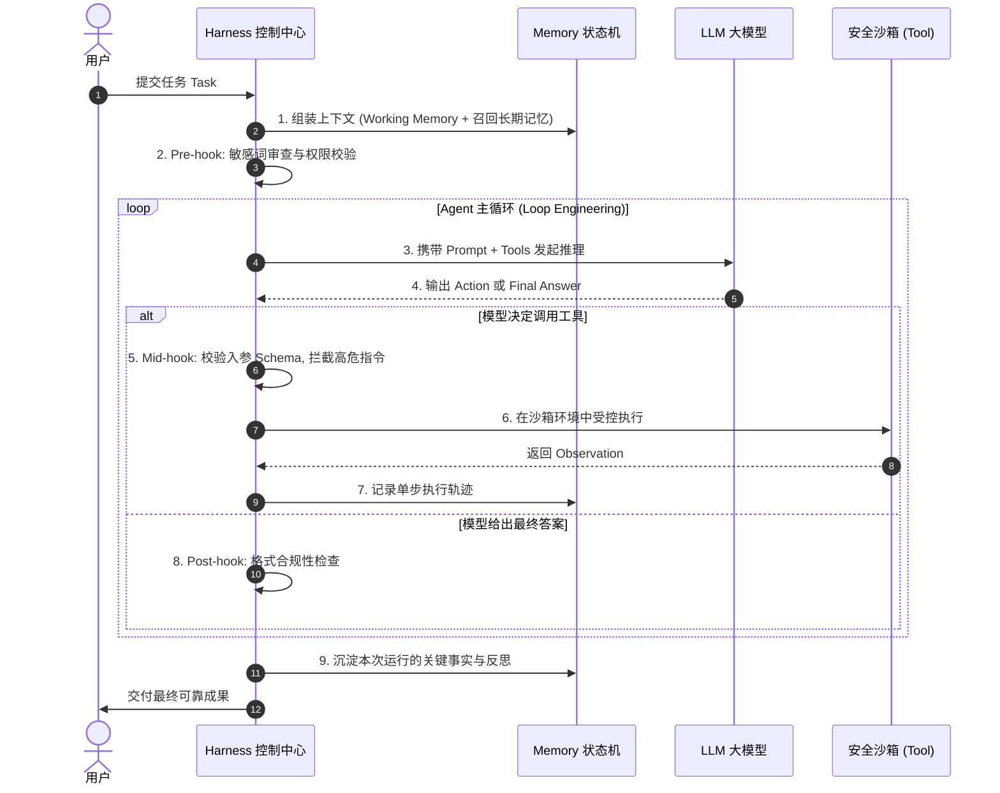

# 06-Harness 与 Loop 工程：驾驭大模型的马鞍与运行时底座

> **本篇对应 GitHub 源码**：`06-harnes/`、`09-loop-engineering/`、`08-hermes-agent/` 与 `99-My idea/`  
> **涵盖核心概念**：Harness 架构本质、Agent Run 生命周期、Loop Engineering、Hook 拦截机制、Eval 评测（Capability vs Reliability）、开源 Hermes 架构拆解  
> **导读**：  
> 很多开发者在做 Agent 时，以为只是写一个 `while True` 循环调用大模型。但为什么真实系统一跑就崩溃、死循环、不可控？在 `99-My idea` 中，作者指出了最核心的心智模型：**“大模型是一匹烈马，而 Harness（驾驭系统）是缰绳和马鞍”**。本篇带你拆解 Agent 运行时底座与循环工程化实践。

---

## 一、核心心智模型：什么是 Harness？

大模型本身具有极高的随机性、容易产生幻觉、不守规矩。光靠单次 Prompt 或简单的循环，根本无法让它在生产环境中稳定工作。

```
              ┌──────────────────────────────────────────────┐
              │                Agent Harness                 │
              │                                              │
              │   ┌──────────────┐      ┌────────────────┐   │
              │   │ Hook 拦截器  │      │ 安全沙箱隔离   │   │
              │   └──────────────┘      └────────────────┘   │
  输入 ───────►                                              ├───────► 稳定输出
              │   ┌──────────────┐      ┌────────────────┐   │
              │   │ Memory 注入  │      │ Eval 可靠性评估│   │
              │   └──────────────┘      └────────────────┘   │
              │                                              │
              │           [ LLM 烈马 (推理核心) ]            │
              └──────────────────────────────────────────────┘
```

> **通俗比喻**：  
> - **LLM 是烈马**：动力极其强劲，但脾气暴躁，随时可能尥蹶子（格式错误、无限循环、超长消耗）；  
> - **Harness 是马鞍与缰绳**：约束它的前进方向（Prompt 与环境沙箱）、随时勒住缰绳刹车（熔断与 Hook 拦截）、给它喂水喂草（Memory 状态注入）、并记录它的每一次奔驰状态（Tracing 与 Eval）。

---

## 二、一次标准的 Agent Run 生命周期

一个工业级的 **Agent Run**（单次端到端执行）包含严格的生命周期阶段：



---

## 三、Loop Engineering：循环工程化的四大护栏

在 `09-loop-engineering` 中，从简单的单步调用演化为自动化循环，必须加上四大工程护栏：

1. **步数熔断器（Max Steps Hard Stop）**：  
   必须硬性限制最大步数（例如 10 步），防止死循环把 API 额度刷爆；
2. **重复行动惩罚（Deduplication Guard）**：  
   检测模型是否连续两次调用完全相同的工具和参数；若发生，强行介入并喂回：“*你刚刚已经尝试过该操作且未取得进展，请尝试换一条解决路线！*”；
3. **输出格式自愈解析器**：  
   解析 JSON 参数时若遇到截断或语法错误，不直接抛出异常崩溃，而是将错误原因作为 Observation 反馈给模型，逼迫其自愈纠错；
4. **Token 预算监视器**：  
   当上下文 Token 逼近模型聪明区上限（Smart Zone ~100K）时，触发上下文压缩（Compact）与滚动摘要。

---

## 四、评估体系：Capability vs Reliability（能力 vs 可靠性）

在 `99-My idea/Agent eval/01-eval.md` 中，作者指出了评测 Agent 的最核心维度：

```
                    ┌────────────────────────┐
                    │      Capability        │  “能不能做？”
                    │      (基础能力)        │  Demo 里跑通一次就算有能力
                    └───────────┬────────────┘
                                │
                                ▼
                    ┌────────────────────────┐
                    │      Reliability       │  “能不能稳定做？”
                    │      (工程可靠性)      │  在生产环境连跑 100 次都不翻车！
                    └────────────────────────┘
```

- **很多人只测 Capability**：在测试用例里只要有一次成功，就欢呼 Agent 成功了；
- **工业级系统必须测 Reliability**：  
  1. **确定性（Determinism）**：相同任务连续执行 10 次，成功率（Pass Rate）是否高于 95%？
  2. **容错自愈率（Self-Healing Rate）**：遇到网络异常或工具报错时，系统能否自行恢复而不挂起？
  3. **单任务平均耗费 Token 漂移率**：同样难度的任务，每次消耗的 Token 是否在合理置信区间内波动？

---

## 五、开源工业级标杆：Hermes Agent 架构拆解

在 `08-hermes-agent` 与 `99-My idea/memory/11.memory.md` 中，Nous Research 开源的 **Hermes Agent** 展现了标准工业级 Harness 的典范设计：

```
Hermes Agent 核心架构：
├── Gateway (网关接入层: 支持 Desktop 终端、WhatsApp、Slack 等多端挂载)
├── Runtime Harness (运行时核心: Ephemeral 短期沙箱执行器 + 状态机)
├── Skills 库 (动态注册的扩展技能: 类似 MCP 协议，按需挂载)
├── Memory 存储层 (Markdown 本地持久化 + 结构化记忆)
└── Cron 定时调度器 (赋予 Agent 离线后台周期性巡检与心跳唤醒能力)
```

- **本地优先（Local-First）**：记忆与状态沉淀在本地 Markdown 文件中，不依赖云端黑盒；
- **自我进化（Self-Improving）**：Agent 在运行中犯错后，能够自己把避坑规则写回自己的 `Skills/Memory` 文件中，下次启动时自动加载经验！

---

## 本篇小结

1. **Harness 是驾驭系统的灵魂**：大模型只是大脑和烈马，Harness 的沙箱、拦截与状态管理才是保障它安全可用的定海神针；
2. **Loop Engineering 必须带护栏**：死循环熔断、重复调用惩罚、格式错误自愈是循环稳健的三大前提；
3. **重视可靠性评测（Reliability）**：告别只看跑通一次的“Demo 幻觉”，以高胜率、低漂移率为工程交付标准；
4. **全套体系闭环**：至此，我们完整串联了 Agent、RAG、Memory、Multi-Agent、ModelRoute 与 Harness 工程底座，构筑起现代 AI 工程师坚不可摧的技术大厦！
