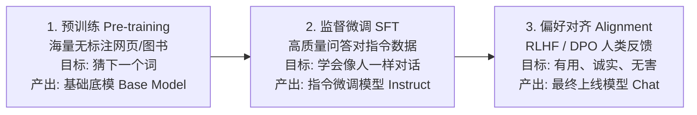
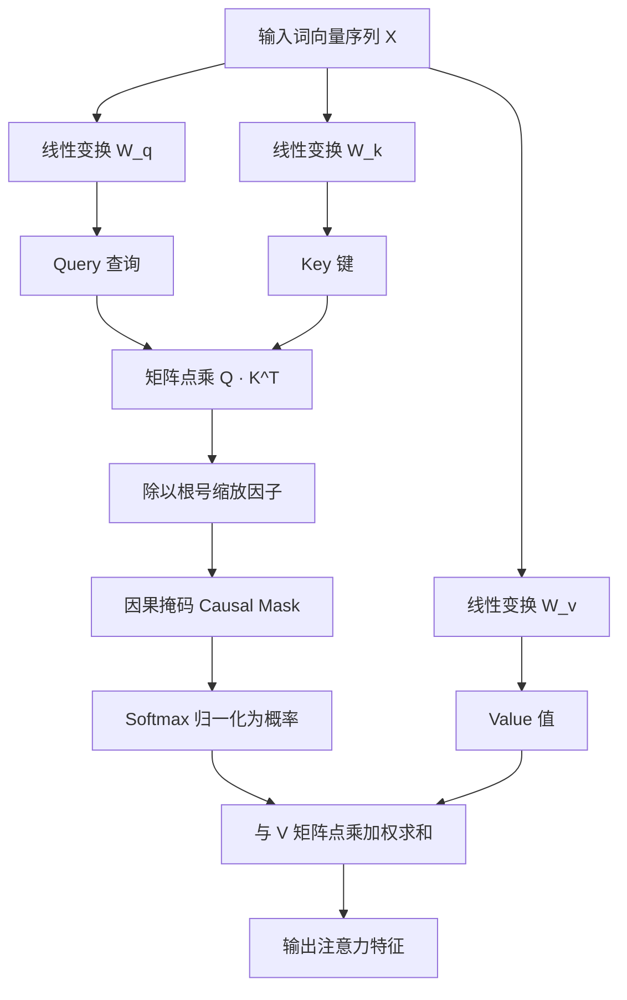
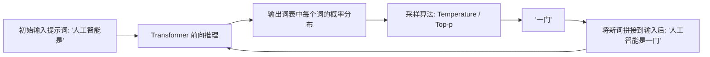

# 07-LLM-From-Scratch：从零手写迷你大语言模型

> **本篇对应 GitHub 源码**：`07-llm_from_scrach/`  
> **涵盖核心内容**：LLM 完整流水线（预训练 -> SFT -> 对齐）、Tokenizer 分词、Token/位置嵌入、自注意力机制（Q, K, V）、因果掩码、多头注意力（MHA）、Transformer Block 堆叠与自回归生成循环  
> **导读**：  
> 在前面几章中，我们把大模型当成黑盒 API 接入调用。但一个真正优秀的 AI 工程师，必须向下看一层：大模型内部究竟是如何把一串文字转化成思考，并逐字预测出下一个词的？本篇彻底拆除黑盒，不搞晦涩难懂的学术黑话，用通俗生动的大白话带你从零手写一个迷你的 GPT/Transformer 大模型！

---

## 零、大模型训练全景生命周期

任何现代大语言模型（如 DeepSeek、GPT-4）的诞生，都经历三大核心阶段：



本篇我们聚焦在最核心的**模型架构（Model Architecture）与自回归推理生成**。

---

## 一、输入处理：文本是如何变成数字的？

计算机只能理解数字矩阵，不能直接阅读文字。输入文字要经过两道工序：

### 1. 分词与 Tokenizer（查字典）
- **分词（Tokenization）**：把句子拆成最小的词元（Token）。例如“机器学习”可能被拆为 `["机器", "学习"]`；
- **词表映射（Vocabulary）**：词表里每一项有一个固定编号。例如 `"机器" -> 1024, "学习" -> 2048`。一句话就变成了一串整数列表 `[1024, 2048]`。

### 2. 词嵌入与位置编码（发身份证与排座位）
- **Token Embedding（词向量）**：每个词编号映射为一个高维向量（例如 768 维数组），代表词的内在含义；
- **Positional Encoding（位置编码）**：自注意力机制天生不分前后顺序。如果只给词向量，“我吃牛排”和“牛排吃我”在模型看来毫无区别！因此必须**给每个词叠加一个“座位号向量”**，标明谁在第一位、谁在第二位。

```
最终输入向量 = 词本身的含义向量 (Token Embedding) + 该词的位置座位向量 (Positional Embedding)
```

---

## 二、核心灵魂：自注意力机制（Self-Attention）第一性原理

Transformer 最伟大的创新就是**注意力机制**。

### 1. 通俗比喻：图书馆查资料（Q, K, V 三剑客）
在自注意力层中，每个输入的词都会通过线性变换产生三个向量：**Query（查询）、Key（键）、Value（值）**。

> **通俗比喻**：  
> 想象你在图书馆找书：  
> - **Query（查询条）**：你手里拿着的需求小纸条，写着“*我想查微积分*”；  
> - **Key（标签条）**：书架上每本书脊梁上贴的分类标签，如“*数学-微积分*”、“*历史-明史*”；  
> - **点积打分（Attention Score）**：拿着你的 Query 和书架上的每一个 Key 去碰。碰出的相似度越高，注意力权重就越大；  
> - **Value（真正的内容）**：书里的具体正文内容。最后，根据打分高低，把各本书的内容加权融合阅读。

```
注意力得分 = Softmax( (Q · K^T) / √d_k )
输出特征   = 注意力得分 · V
```



---

### 2. 因果掩码（Causal Mask）：严防死守不能看答案！
在自回归生成模型（如 GPT）中，模型在预测“第 3 个词”时，**绝对不能提前偷看第 4、第 5 个词！**  
- **因果掩码的实现**：构造一个上三角矩阵，把未来位置的注意力得分强行赋予负无穷大（$-\infty$）；
- 经过 Softmax 后，$e^{-\infty} = 0$，模型对未来词的注意力权重严格为 0，只能老老实实看过去的历史上下文。

---

## 三、多头注意力（Multi-Head Attention）与前馈网络

### 1. 为什么要“多头”（Multi-Head）？
单个注意力头只能捕捉一种关联关系（比如只关注主语和谓语）。  
**多头注意力（MHA）** 相当于组建了 8 个或 12 个平行的“专家组”：
- 头 1 专心看语法主谓对应；
- 头 2 专心看代词指代（“它”到底指谁）；
- 头 3 专心看前后时态连贯；
- 最后把所有头的输出拼起来，捕捉极其立体的语言关联。

### 2. 前馈神经网络（FFN）与残差连接
- **FFN（两层感知机）**：在注意力层融合上下文之后，对每一个位置的向量进行非线性变换，提取深层抽象知识；
- **残差连接（Add & Norm）**：每一层都采用 $x + \text{Layer}(x)$ 的跳连结构，防止神经网络太深时梯度消失。

---

## 四、自回归文本生成循环（Autoregressive Loop）

模型训练好后，是怎么源源不断向外吐字（Streaming）的？这就是经典的**自回归生成循环**：



### 极简生成代码实现（纯 PyTorch 核心控制流）
```python
import torch
import torch.nn.functional as F

def generate_text(model, input_ids, max_new_tokens=20, temperature=0.7):
    """自回归逐字生成主循环"""
    model.eval()
    
    for _ in range(max_new_tokens):
        # 1. 前向传播，输出 logits (Batch, Seq_len, Vocab_size)
        with torch.no_grad():
            logits = model(input_ids)
            
        # 2. 只需要看序列最后一个位置的预测结果
        next_token_logits = logits[:, -1, :] / temperature
        
        # 3. Softmax 转化为概率分布
        probs = F.softmax(next_token_logits, dim=-1)
        
        # 4. 根据概率分布采样下一个 Token
        next_token = torch.multinomial(probs, num_samples=1)
        
        # 5. 将新 Token 追加到历史输入尾部，进入下一轮预测
        input_ids = torch.cat([input_ids, next_token], dim=1)
        
    return input_ids
```

---

## 本篇小结

1. **大模型的本质**：一个高精度的下一个 Token 概率预测器；
2. **输入两步走**：Tokenizer 查字典映射为 ID，Token Embedding + 位置编码赋予语义和座位号；
3. **自注意力机制（Q, K, V）**：用查图书馆做比喻，Q 与 K 点乘算出相关度权重，加权提取 V 的内容；
4. **因果掩码（Causal Mask）**：强行阻断未来的信息泄漏，保证自回归生成的因果性；
5. **多头注意力与残差堆叠**：多组专家分工观察，残差连接保障深层网络稳健前行；
6. **下一篇预告**：搞懂了模型的内部结构后，工业界开源的工业级 Agent 是如何组织架构的？下一篇进入 **08-Hermes-Agent：开源工业级 Agent 源码精读**！
