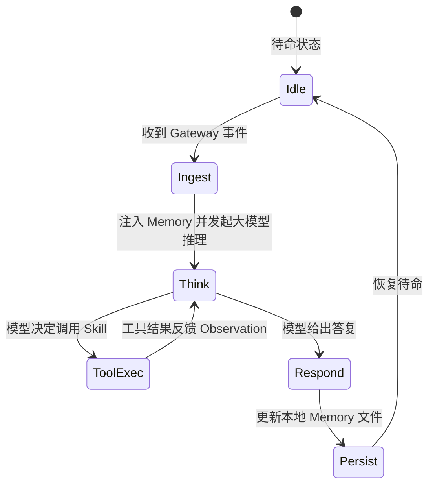

# 08-Hermes-Agent：工业级开源 Agent 源码精读与架构解构

> **本篇对应 GitHub 源码**：`08-hermes-agent/` 与 `99-My idea/`  
> **涵盖核心内容**：Nous Research 开源 Hermes Agent 架构拆解、Gateway 网关多端接入、Runtime 主循环、Skills 动态扩展体系、本地优先 Markdown 记忆系统、Cron 离线定时调度器、Agent 自我进化机制  
> **导读**：  
> 很多开发者学完 Agent 理论后，依然不知道真实工业级 Agent 开源项目是怎么组织代码的。Nous Research 团队开源的 **Hermes Agent**（Star 破 2 万的工业级标杆）是学习 Agent 架构的绝佳教材。本篇对照仓库精读源码，用最直白的大白话拆解 Hermes 是如何实现本地优先、多端接入、技能扩展与自我进化的。

---

## 零、全景架构：Hermes Agent 到底长什么样？

在 `99-My idea/memory/11.memory.md` 中，作者指出：**Hermes Agent 是一个典型的“本地优先、可自进化”的标准 Agent Harness 范式**。

```
                    ┌─────────────────────────────────────────┐
                    │          Gateway 多端接入网关           │
                    │   (CLI 终端 / WhatsApp / Slack / Web)   │
                    └────────────────────┬────────────────────┘
                                         │ 事件与消息流
                                         ▼
                    ┌─────────────────────────────────────────┐
                    │            Runtime 主循环引擎           │
                    │   (Ephemeral 执行上下文 + 状态机流转)   │
                    └──────┬─────────────┬─────────────┬──────┘
                           │             │             │
              ┌────────────▼──┐   ┌──────▼──────┐   ┌──▼────────────┐
              │  Skills 动态库│   │  本地 Memory│   │  Cron 调度器  │
              │(类似 MCP 插件)│   │(Markdown文件)│   │ (离线心跳巡检)│
              └───────────────┘   └─────────────┘   └───────────────┘
```

---

## 一、模块 1：Gateway 多端接入网关

### 1. 痛点：为什么不要把界面和逻辑绑死？
初学者写 Agent 往往把终端 `input()` 或网页前端直接写进主循环中，导致换一个平台（如想搬到企微或飞书）时必须重构所有逻辑。

### 2. Hermes 的解法：网关协议抽象
- **Gateway 网关层**充当适配器：
  - 既能作为命令行 CLI 工具运行；
  - 也能挂载在 WhatsApp、Telegram、Slack 上作为后台 Bot；
- 无论消息从哪里来，网关都把它包装为标准的 `UserMessage` 投递给 Runtime，做到了**接入层与智能体逻辑的彻底解耦**。

---

## 二、模块 2：Runtime 主循环与沙箱隔离

### 1. Ephemeral（即用即弃）执行沙箱
每次用户发送一个复杂任务，Hermes 不会在全局状态里直接乱改，而是为这次任务启动一个**独立的临时沙箱会话（Ephemeral Session）**：
- 为该会话分配独立的目录空间与环境变量；
- 即使任务中途执行失败或报错，不会污染用户本地的核心文件系统。

### 2. 状态机流转控制


---

## 三、模块 3：Skills 动态技能库（插件机制）

### 1. 类似 MCP（Model Context Protocol）的即插即用设计
Hermes 的工具不是写死在代码里的，而是组织在 `skills/` 文件夹下。每个 Skill 是一个独立的 Python 模块：
- 包含工具的元数据描述（Description）；
- 包含参数 Schema；
- 包含真实的执行函数。

### 2. 动态加载（Lazy Loading）
系统在启动时不把几十个工具的冗长代码全塞进 Prompt，而是只向大模型暴露 Skill 目录摘要；当模型判定需要某个专门技能（例如 `docker_manager` 或 `git_helper`）时，系统才**动态加载对应技能的完整入参规范**，大幅节约了上下文 Token！

---

## 四、模块 4：本地优先的 Markdown 记忆系统

这是 Hermes Agent 最优雅的设计之一：**不依赖复杂的云端数据库，完全依靠本地 Markdown 文件持久化记忆！**

```
~/.hermes/
├── memory/
│   ├── user_profile.md    # 用户画像（姓名、偏好、工作习惯）
│   ├── project_context.md # 当前项目的架构背景、技术栈
│   └── lessons_learned.md # 失败教训与避坑规则库
```

### 为什么选择 Markdown 作为记忆介质？
1. **天然适合 LLM 阅读与编辑**：大模型读写 Markdown 的格式遵从性最好；
2. **人类完全透明可控**：用户只要在本地用记事本打开 `user_profile.md`，就能清楚看到 Agent 记住了自己什么，随时可以人工增删改查；
3. **极佳的差分对比（Diff）**：配合 Git 做版本控制，每一次记忆的变更轨迹都清清楚楚。

---

## 五、模块 5：自我进化机制（Self-Improving Loop）

Hermes 拥有极强的**自我修养（Self-Improvement）**能力：


> **通俗比喻**：  
> 就像一个新员工，第一次把配置文件改错了导致服务重启失败。排查搞定后，他在自己的备忘录（`lessons_learned.md`）写下：“*下次修改完必须先执行 config check 才能重启！*”  
> 下一次遇到类似任务，他先翻看备忘录，便再也不会踩坑！

---

## 六、模块 6：Cron 离线定时调度器

普通 Agent 都是被动的（你不跟它说话，它就像死了一样）。  
Hermes 内置了 **Cron 调度守护进程**：
- 用户可以对它说：“*每天早上 9 点帮我巡检一下服务器磁盘占用，超过 80% 给我发通知*”；
- Cron 调度器常驻后台，到点自发唤醒 Agent 主循环，自动调用工具执行检查，完成从“被动响应”到“主动智能”的跃升。

---

## 本篇小结

1. **工业级 Agent 的分层标杆**：Gateway 适配多端、Runtime 驱动循环、Skills 即插即用、Memory 本地沉淀；
2. **本地优先与人类可控**：用简单的 Markdown 文件替代昂贵的云端数据库，透明直观且易于维护；
3. **自我进化才是灵魂**：把失败教训固化为本地策略记忆，让 Agent 拥有随着使用越来越聪明的能力；
4. **下一篇预告**：有了完整的 Agent 工业级架构，如何搭建自动化流水线和严苛的可靠性评测？下一篇进入 **09-CICD-and-Eval：Agent 测试、流水线与可靠性评测**！
