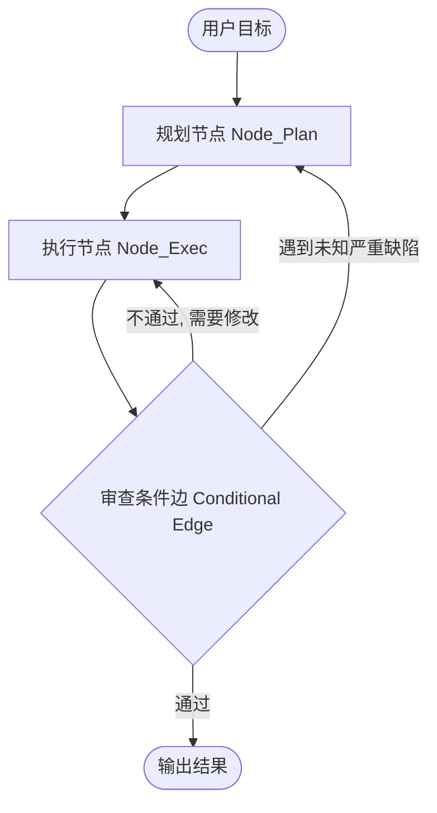
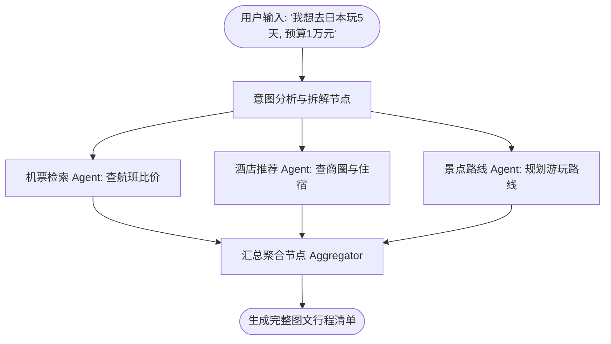

# 10-LangGraph：图状态机多智能体实战

> **本篇对应 GitHub 源码**：`11-langgraph/`  
> **涵盖核心内容**：有向图状态机架构（StateGraph）、Nodes 节点与条件边（Conditional Edges）、Human-in-the-loop 人机协同断点、开源项目 TripMate 旅行规划多智能体实战  
> **导读**：  
> 很多开发者在用 LangChain 时，发现传统的线性链（Chain）根本无法实现“分支判断、失败循环回退、复杂多角色跳转”。LangChain 团队因此推出了 **LangGraph**。它把多智能体系统抽象为一张“有向图状态机”。本篇对照源码实战，用通俗生动的大白话带你搞懂 LangGraph 的核心思想与旅行助手项目落地。

---

## 零、心智模型：为什么我们需要“图（Graph）”？

传统的流水线是线性的（`A -> B -> C`）。但真实世界的复杂任务到处充斥着循环与分支：



- **普通的 Chain 是一条单行道**，无法回头；
- **LangGraph 是一张立交桥交通图**：可以向前推进，可以按条件拐弯，也可以在报错时退回上一个路口重新规划！

---

## 一、LangGraph 核心三要素

要搭起一张 LangGraph 图，只需要搞懂三个概念：

1. **State（共享状态）**：  
   整张图流转时传递的上下文数据包（类似之前第 4 章讲的“共享黑板”），通常用 Python 的 `TypedDict` 定义；
2. **Nodes（节点）**：  
   图上的每一个检查站。每个 Node 是一个具体的 Python 函数或 Agent。它的输入是当前 State，输出是修改或更新后的 State；
3. **Edges（边 / 连接线）**：  
   决定下一步走向哪里：
   - **普通边（Normal Edge）**：执行完节点 A 必定走向节点 B；
   - **条件边（Conditional Edge）**：根据大模型当前的输出或判断结果，决定走向分支 1 还是分支 2。

---

## 二、极简代码实现：手搭一个带循环的图

```python
from typing import TypedDict, Annotated
import operator

# 1. 定义全局共享状态 State
class AgentState(TypedDict):
    task: str
    code: str
    review_status: str

# 2. 定义各个节点的具体行为函数 (Nodes)
def coder_node(state: AgentState):
    print(">> [Coder 节点] 正在编写/修改代码...")
    return {"code": "print('hello world')", "review_status": "PENDING"}

def reviewer_node(state: AgentState):
    print(">> [Reviewer 节点] 正在审查代码...")
    # 模拟审查逻辑：如果代码合格返回 PASS，否则 REVISE
    is_pass = "hello" in state["code"]
    status = "PASS" if is_pass else "REVISE"
    return {"review_status": status}

# 3. 定义条件分支路由逻辑
def check_review_result(state: AgentState) -> str:
    if state["review_status"] == "PASS":
        return "approved"  # 走向结束
    return "rejected"      # 走向返工修改
```

### 组装图并编译（`StateGraph`）
```python
from langgraph.graph import StateGraph, END

# 初始化图对象
workflow = StateGraph(AgentState)

# 添加节点
workflow.add_node("coder", coder_node)
workflow.add_node("reviewer", reviewer_node)

# 设置起点与普通边
workflow.set_entry_point("coder")
workflow.add_edge("coder", "reviewer")

# 添加条件边：根据审查结果决定走向
workflow.add_conditional_edges(
    "reviewer",
    check_review_result,
    {
        "approved": END,      # 审查通过，流程终结
        "rejected": "coder"   # 审查不通过，闭环回退到 coder 重新修改！
    }
)

# 编译为可执行的 App
app = workflow.compile()
```

---

## 三、Human-in-the-loop（人机协同审批断点）

在很多高危操作（如执行转账、向全员发邮件、部署线上服务）中，我们不能完全放任 AI 自己跑完，必须有人工介入（HITL）。

LangGraph 内置了**中断（Interrupt）机制**：
- 在高危节点执行前设置 `checkpointer` 断点；
- 图执行到该节点自动暂停并持久化当前状态；
- 等待人类管理员在后台点击“同意”或修改参数后，一键恢复执行，完美兼顾自动化与安全性。

---

## 四、实战剖析：TripMate 多智能体旅行规划系统

在原项目 `11-langgraph/03-project-TripMate...` 中，作者实现了一个完整的生产级多智能体旅行规划系统：



- **并行执行（Fan-out）**：当用户给出目标后，机票 Agent、酒店 Agent 和景点 Agent 可以**并行同时开展检索**，大幅缩短端到端响应时间；
- **聚合汇流（Fan-in）**：聚合节点等待所有子 Agent 成果到齐后统一组装为最终行程书，展现了图状态机在大规模多任务编排中的巨大威力！

---

## 本篇小结

1. **为什么选择图（Graph）**：打破线性链的束缚，天然支持循环回退、分支条件与并行汇流；
2. **核心三要素**：State 是共享数据，Nodes 是具体执行人，Edges 是路线分流控制器；
3. **安全护栏**：通过 Human-in-the-loop 人工断点，确保高风险操作万无一失；
4. **下一篇预告**：除了 LangGraph，开源界还有哪些极其轻巧优美的 Agent 教学级实现？下一篇进入 **11-Small-Agent-Waku-and-Pi：waku 与 Pi 架构深度剖析**！
