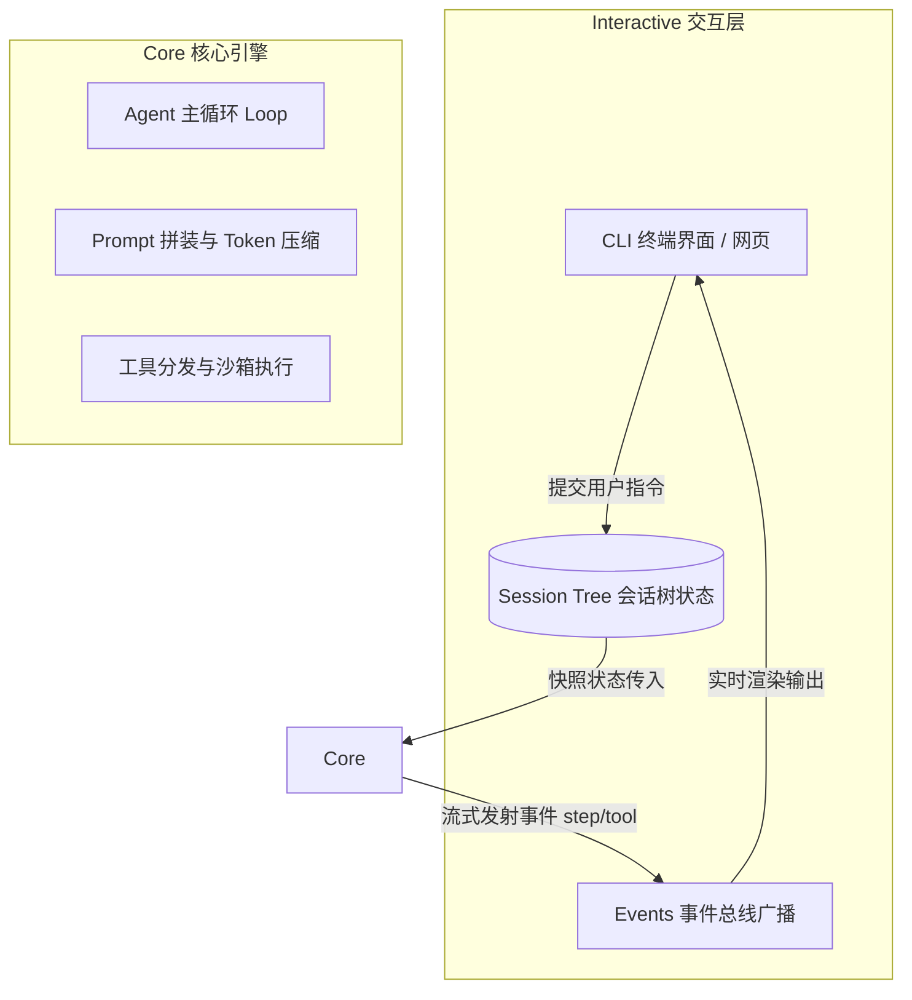
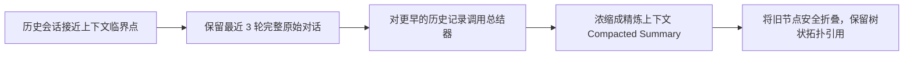

# 11-Small-Agent-Waku-and-Pi：轻量级教学助手架构深度解构

> **本篇对应 GitHub 源码**：`12-hermes-agent-small/`（waku）与 `13-pi-agent/`  
> **涵盖核心内容**：waku 四大支柱（Harness / Loop / Memory / Eval）、Pi Agent 架构解构、Core 与 Interactive 彻底解耦、会话状态树（Session Tree）、上下文智能压缩（Compaction）、事件流体系（Events）  
> **导读**：  
> 很多商业级框架（如 LangChain、AutoGPT）为了兼容五花八门的需求，写了成千上万行代码和十几层继承抽象，让初学者很难看清 Agent 的极简本质。原项目中的 `waku` 和 `pi-agent` 是两款极其精妙的教学级小 Agent。本篇用最通俗直白的大白话拆解它们的干净架构，帮你建立最纯粹的系统心智模型。

---

## 零、为什么一定要读轻量级教学项目？

> **经典名言**：  
> “如果你无法在一千行代码内把一个系统手写出来，说明你并没有真正看透它的本质。”

- **waku（Python 本地助手）**：把大模型应用剥离到只剩最精简的四大支柱：**Harness 驾驭层、Loop 主循环、Memory 记忆管理、Eval 评测验证**；
- **Pi Agent（现代 TS/JS 架构标杆）**：展示了工程解耦的最高境界——**Core（核心引擎）与 Interactive（交互界面）彻底分离**。

---

## 一、Pi Agent 的核心解耦哲学：Core vs Interactive

在很多混乱的代码中，开发者把大模型调用、命令行打印 `print`、前端 WebSocket 混在一起。  
Pi Agent 确立了标准的二层解耦：



### 1. Core（纯粹的核心引擎）
- **无状态（Stateless）**：它不关心任何界面，不关心你用的是 CLI 还是 Web 页面；
- **纯函数驱动**：输入是一份状态快照（State），它只负责驱动推理、调用工具、并在完成时返回结果。

### 2. Interactive（交互与状态树管理）
- 负责接收用户键盘输入；
- 负责维护用户的**会话分支历史（Session Tree）**；
- 负责监听 Core 发射出来的流式事件并优雅渲染在屏幕上。

---

## 二、会话状态树（Session Tree）：像 Git 一样支持分支与撤回

普通聊天界面是一维线性的（问一句、答一句）。如果大模型回答偏了，用户只能开个新窗口重新来。  
Pi Agent 引入了类似 Git 版本控制的**会话状态树（Session Tree）**：

```
       Root 根节点
         │
         ├── Commit 1 (用户: 帮我写个网页)
         │     │
         │     ├── Commit 2A (方案 A: 用 React 实现) ──> 分支 1
         │     │
         │     └── Commit 2B (方案 B: 用 Vue 实现)   ──> 分支 2 (Fork)
```

- **撤销重试（Undo / Fork）**：用户可以随时“时光倒流”退回 Commit 1，切入一条全新的思考分支；
- **无损比对**：两条分支的历史彼此隔离，完全不干扰，展现了现代会话系统的前沿设计。

---

## 三、上下文智能压缩（Compaction）：大扫除机制

随着会话分支越来越深，Token 迟早会接近上下文上限。  
Pi Agent 设计了一套优雅的 **Compaction（压缩）流程**：



- 不粗暴删除旧节点，而是像 Git 做大版本打标签一样，生成一个摘要快照；
- 既守住了大模型的“聪明区（Smart Zone）”，又确保了历史脉络完整可追溯。

---

## 四、事件流体系（Events）：极致流畅的流式体验

为了让用户看到像 Cursor 或 ChatGPT 一样丝滑的动态打字机效果，系统绝不能等到全部跑完再一次性返回。  
Core 引擎在运行中会向外持续抛出细粒度的**生命周期事件（Events）**：

```text
1. event: "step:start"     -> 告诉前端: 智能体开始这一轮思考了
2. event: "token:delta"    -> 逐字吐出大模型正在思考的文字
3. event: "tool:start"     -> 告诉前端: 决定调用终端执行命令
4. event: "tool:output"    -> 实时把命令行的运行输出推给屏幕
5. event: "step:finish"    -> 本轮步骤结束
```

前端 UI 只需要监听这套标准事件流，即可轻松做出酷炫的实时动效。

---

## 本篇小结

1. **大道至简**：通过 waku 和 Pi 这类轻量项目，剥离繁杂的第三方包装，直击 Agent 运作的四大支柱；
2. **核心解耦架构**：Core 保持纯粹与无状态，Interactive 负责状态树与交互，各司其职；
3. **Session Tree 与 Compaction**：用类似 Git 的分支树管理多轮探索，搭配优雅的上下文压缩，打造生产级长寿命智能体；
4. **下一篇预告**：有了扎实全面的 Agent 与工程技术栈，如何将它们落地到现代程序员最关心的领域 —— **12-AICoding-Workflow：AI Coding 完整工作流与实战方法论**！
