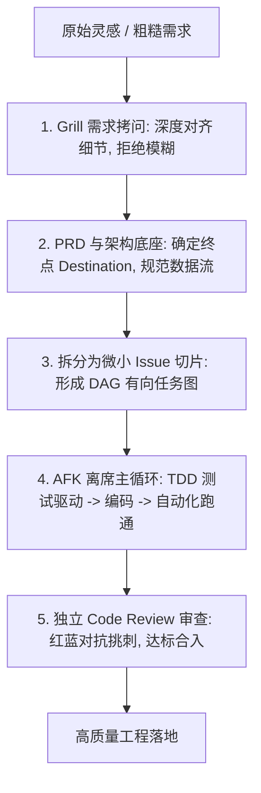

# 12-AICoding-Workflow：AI Coding 完整工作流与实战方法论

> **本篇对应 GitHub 源码**：`99-My idea/AI coding/`（`full_workflow.md` & `interview_workflow.md`）  
> **涵盖核心内容**：Smart Zone 与 Dumb Zone 边界管理、Momento 效应、为什么盲目 Vibe Coding 必烂尾、五步标准研发流（Grill 拷问 -> PRD 规划 -> 小切片 Issue/DAG -> AFK Agent 离席循环 -> Code Review 门禁）  
> **导读**：  
> 随着 Cursor、Claude Code 等 AI 编程工具爆火，很多程序员习惯“给大模型丢一句简略需求，直接让它狂飙写代码”（俗称 Vibe Coding）。刚开始 10 分钟极其爽快，但半小时后代码就会到处暗藏隐蔽 Bug，改东墙漏西墙，最终全盘重写烂尾。在 `99-My idea` 中，作者系统总结了一套真正工业级的 **AI Coding 全流程工程化实战范式**。本篇带你拆解如何把大模型驯服为真正高效的编码战友！

---

## 零、反直觉真相：为什么直接丢大任务必定翻车？

很多人的典型失败路径：
1. 对大模型说：“*帮我从零写一个高并发的外卖点餐系统，包含用户端、商家端和订单支付*”；
2. 大模型唰唰吐出 2000 行看起来非常漂亮的伪代码；
3. 你复制到本地一跑，到处是缺少导入、数据库配置未对齐、逻辑断层的报错；
4. 你把报错丢给大模型修，它修好了 A 又搞坏了 B，几轮下来上下文膨胀到 10 万 Token，模型彻底陷入幻觉瘫痪。

> **核心定律（Smart Zone vs Dumb Zone）**：  
> - **Smart Zone（聪明区，~0-100K Token）**：大模型的推理注意力极其集中敏锐，能够精准遵守全部约束；  
> - **Dumb Zone（笨蛋区，>100K Token）**：当上下文塞满了几十轮互相推诿的历史报错，大模型发生“注意力腐化”，开始视而不见你最初的规范，变得极其愚蠢。

---

## 一、工业级 AI Coding 五步标准流水线



---

## 二、步骤详解与实战心法

### 步骤 1：Grill 需求拷问（先动脑，后动键盘）
大模型最擅长根据清晰的信息做推演，最害怕“模糊不清的一句话大词”。
- **做法**：在动手写一行代码前，让大模型充当挑剔的技术架构师，对你进行“严苛的面试拷问（Grill）”；
- **Prompt 引导**：“*这是我的粗略想法，请挑出其中所有没有定义清楚的业务边界、异常边界和技术选型问题，向我提问 5 个核心问题！*”；
- 只有把边界问透、把模糊需求压平，才能进入下一步。

---

### 步骤 2：PRD 规范与终点定义（Destination）
- 明确输出一份结构化的技术文档：数据模型（Schema）、API 接口定义、输入输出约束；
- **原则**：PRD 是我们前行的“GPS 导航图”，在编码过程中，大模型必须时刻以 PRD 为绝对准绳，绝不随意扩展自以为是的功能。

---

### 步骤 3：切分为微小 Issue 切片（形成 DAG 依赖图）
**永远不要让大模型一次性写整个系统！**  
把一个庞大任务，切解为一个个**独立、可在 10~15 分钟内快速验证的小切片 Issue**：

```
大任务: 用户积分商城
├── Issue 1: 设计并创建积分数据库表与迁移脚本 (无依赖)
├── Issue 2: 编写基础加减积分纯函数与边界单测 (依赖 Issue 1)
├── Issue 3: 封装 HTTP API 路由与鉴权中介 (依赖 Issue 2)
└── Issue 4: 编写前端极简兑换展示卡片 (依赖 Issue 3)
```

每个切片拥有独立的会话上下文，**严格在 Smart Zone（0~30K Token）内瞬间完成并提交**，绝不把上一个切片的调试噪音带给下一个切片！

---

### 步骤 4：AFK 离席自动化循环（TDD 测试驱动开发）
这是程序员生产力解放的真正高光时刻（Away-From-Keyboard）：
1. **先写测试（Test-Driven Development）**：让模型先根据接口规范写出失败的单元测试用例（红灯）；
2. **编写功能代码**：让模型实现业务逻辑；
3. **本地沙箱自动执行测试**：测试报错自动回填给模型，模型自主排错自愈；
4. **绿灯全过**：测试用例全部打勾通过，自动执行 Git Commit 暂存成果。

---

### 步骤 5：独立的 Code Review 审查门禁
自己写的代码自己检查往往看不出毛病。  
在合入主分支前，开启一个全新、独立的会话，配置严苛的审校角色（Reviewer）：
- 对比本次改动的 Git Diff；
- 检查是否存在 SQL 注入、未处理的边界异常、性能隐患或代码坏味道；
- 只有通过审查员的审批，才正式 Merge 合入代码库。

---

## 本篇小结

1. **Vibe Coding 是玩具，工作流工程才是生产力**：告别模糊大词的狂飙盲写，用结构化流程保障确定性；
2. **永远留在 Smart Zone**：通过小切片 Issue 将单次上下文控制在 50K 以内，彻底告别 Context Rot；
3. **TDD 是 Agent 的定海神针**：有了可自动化运行的测试用例，大模型就拥有了客观判决的指南针，能够实现真正的无人值守自愈；
4. **全套知识库大圆满**：至此，我们从底层模型架构、Agent 主循环、RAG 知识库、分层记忆系统，一路走到开源工业级架构与最前沿的 AI Coding 全流程方法论！
