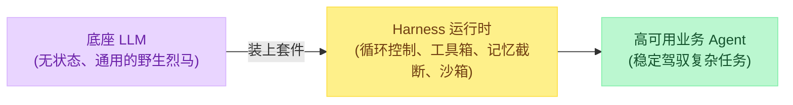
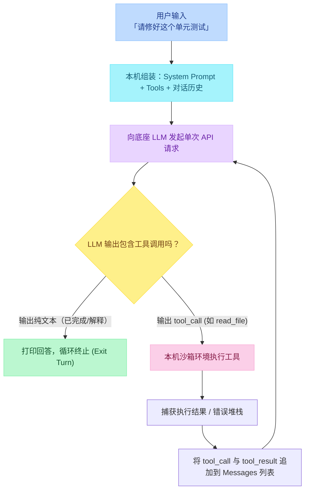
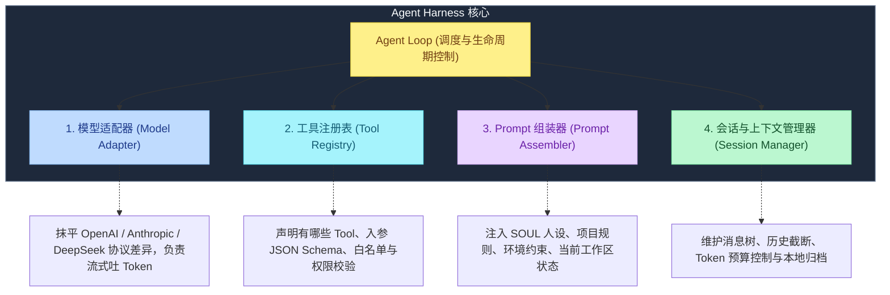
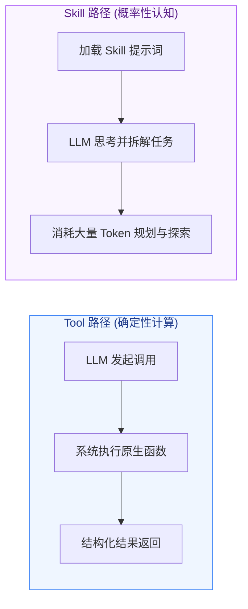

# 13 - DeepSeek Harness 架构解析：配置驱动与自我进化的 Agent 底座

> **定位**：解构 DeepSeek Harness 的架构哲学，剖析现代 Coding Agent 的核心环路，并阐明从“硬编码 Agent”到“配置驱动、自我热重载 Agent”的范式转移。

---

## 一、为什么需要 Harness？

在开源大模型与商业 API 唾手可得的今天，很多人的直觉是：“模型越强，Agent 自然就越聪明”。但工业界工程实践得出的结论恰恰相反：

$$\text{智能表现} = \text{底座模型能力} \times \text{运行时工程外壳 (Harness)}$$

> **核心认知**：
> - **模型是租来的**：无论 DeepSeek-R1、Claude 3.7 还是 GPT-4o，模型本质上只是一个无状态的“单次 Token 预测函数”。
> - **Harness 才是你自己的**：控制循环何时转、给模型喂什么、怎么执行工具、异常怎么拦截、历史怎么压缩，全部由跑在本机或业务服务器上的 **Harness（马具 / 运行时外壳）** 说了算。



---

## 二、所有 Coding Agent 共通的底层骨架

无论是 Claude Code、Cursor、Hermes Agent、Shockwave 还是 DeepSeek Harness，拆解到底层，所有 Agent 的运行骨架完全一致：**一个由本机程序驱动的 Agent Loop**。



### 1. 术语厘清
- **Step（单步）**：LLM 给出一次决策，本机执行一次工具并返回结果，绕一圈称为一步。
- **Turn（轮次）**：从用户发起请求开始，Agent 在内部连续调用多个工具，直到最后输出纯自然语言回复用户退出循环，全过程算作一轮。
- **Loop 本质**：打到远程模型提供商的，每一次都只是独立的无状态 API；所谓“模型拥有上下文”，完全是因为本机的 Session 管理器在每一轮递归时，把越积越长的 `messages` 历史整体重新打包发送。

---

## 三、Coding Agent 的四大核心构件

剥离所有界面包装后，一个标准的 Coding Agent 仅由四大构件组成：



工业界评估一个 Harness 设计好坏的终极标准：**哪几个构件可以无缝替换，而不需要 fork 整个项目去重新编译核心代码？**

---

## 四、核心分水岭：代码驱动 vs 配置驱动 (Code vs Config)

DeepSeek Harness 之所以引发广泛关注，核心差异在于它打破了传统“代码写死 Agent”的范式，走向了“配置驱动（Config-Driven）”。

### 1. 传统模式：代码驱动（Code-Driven）
在主流框架（如传统 LangChain Agent、很多定制 CLI）中：
- 系统的工具列表是写死在 Python/TypeScript 类里的：`tools = [ReadFile(), WriteFile(), RunBash()]`。
- System Prompt 是在源码里硬拼接的。
- **致命瓶颈**：Agent 无法修改自身。即便 LLM 写出了一段优化后的新代码或新工具，程序必须经过重新编译、重新打包、重启进程甚至重新部署后才能生效。

### 2. 演进模式：配置驱动（Config-Driven）
DeepSeek Harness 将 Agent 的身份、System Prompt、可用工具列表、甚至调度策略全部抽象为动态配置（JSON/YAML）：
- 进程常驻运行，但**驱动程序行为的是外部配置文件**。
- 每一轮 Loop 启动时，系统都会基于当前最新的配置进行动态组装。
- **热重载（Hot Reload）**：配置文件更新后无需重启进程，下一轮单步即可原地生效。

```mermaid
flowchart TD
    subgraph CodePath["传统代码驱动 (Code-Driven)"]
        C1["Agent 想扩展自身能力"] --> C2["生成新的工具源码"]
        C2 --> C3["修改工程源文件"]
        C3 --> C4["触发编译 / 打包构建"]
        C4 --> C5["终止原进程并重新部署"]
        C5 --> C6["新能力在下一次启动生效"]
    end

    subgraph ConfigPath["DeepSeek Harness 配置驱动 (Config-Driven)"]
        F1["Agent 想扩展自身能力"] --> F2["生成工具脚本或配置条目"]
        F2 --> F3["更新配置清单 (config.json)"]
        F3 --> F4["运行时文件监听热重载 (Hot Reload)"]
        F4 --> F5["下一轮 Loop 原地加载并调用新能力"]
    end

    style CodePath fill:#FFF1F2,stroke:#F43F5E,color:#881337
    style ConfigPath fill:#ECFDF5,stroke:#10B981,color:#064E3B
```



---

## 五、关键辨析：Tool 与 Skill 的本质分野

在许多 Agent 讨论中，Tool（工具）和 Skill（技能）经常被混为一谈。DeepSeek Harness 明确厘清了这两者的工程边界：

| 维度 | Tool（工具） | Skill（技能） |
| :--- | :--- | :--- |
| **执行载体** | 计算机原生代码（Python / Bash / API Client） | LLM 自身进行语义理解与多步推理 |
| **执行确定性** | **100% 确定性**：输入确定的参数，得到确定的返回值 | **概率性**：由模型理解脚本意图并自由编排 |
| **计算与 Token 成本**| 极低（消耗本机 CPU / 网络 I/O，不耗费 Token） | 极高（反复在 LLM 脑中推理，消耗大量 Token） |
| **典型案例** | 查天气 API：`weather(city="BJ") -> 22°C` | 代码重构：阅读文档 -> 理解架构 -> 决定如何修改 |



> **设计准则**：
> 凡是能写成确定性代码的逻辑（如正则过滤、天气查询、SQL 执行、测试用例运行），必须下沉为 **Tool**，严禁让模型靠脑补生成伪数据；只有开放式探索、方案决策才交给 **Skill**。

---

## 六、自我进化 Agent 的运行机制

当 Harness 实现了配置驱动与原生工具热挂载之后，Agent 首次获得了“自我扩展与自我修整（Self-Evolving）”的闭环能力：

```python
# 概念骨架：支持热重载的配置驱动 Harness Loop
import json
import importlib
from pathlib import Path

class ConfigDrivenHarness:
    def __init__(self, config_path: str):
        self.config_path = Path(config_path)
        self.config = self.load_config()
        self.tools = self.build_tools()

    def load_config(self) -> dict:
        with open(self.config_path, "r", encoding="utf-8") as f:
            return json.load(f)

    def reload_if_changed(self):
        """每一步执行前检查配置是否有变动"""
        new_config = self.load_config()
        if new_config != self.config:
            self.config = new_config
            self.tools = self.build_tools()
            print("[Harness] 检测到配置变动，已完成原地热重载！")

    def build_tools(self) -> dict:
        """根据配置文件动态装配工具函数"""
        registry = {}
        for tool_name, meta in self.config.get("tools", {}).items():
            # 动态加载模块与函数，无需硬编码 import
            module = importlib.import_module(meta["module"])
            registry[tool_name] = getattr(module, meta["func"])
        return registry

    def step(self, messages: list) -> dict:
        self.reload_if_changed()
        # 1. 调用 LLM（注入当前的 tools schema）
        # 2. 如果 LLM 决定调用动态创建的工具，直接从 registry 执行
        # 3. 如果 LLM 输出修改配置的请求，直接更新 config.json
        pass
```

### 演进步骤展示：
1. **发现盲区**：Agent 在执行任务时发现自己没有“解析特定格式二进制文件”的工具。
2. **生成工具**：Agent 自行编写一段 Python 脚本 `parse_bin.py`，放置在本地工具库目录中。
3. **注册新能力**：Agent 调用系统内置的基础配置修改接口，将 `parse_bin` 的元数据写入 `harness_config.json`。
4. **即时重载**：下一轮单步开启时，Harness 触发 `reload_if_changed()`，无需重启控制台，Agent 在下一个 Step 中即可成功调用刚写好的 `parse_bin`。

---

## 七、工程落地防护：自进化的边界控制

尽管“能修改自身的 Agent”极具吸引力，但在工业界落地必须设立绝对防护墙：

1. **核心调度不可覆写**：Loop 控制器、紧急熔断机制必须是底层只读代码，绝不能暴露给 Agent 的修改权限中。
2. **动态 Tool 沙箱隔离**：Agent 自主生成的工具必须在轻量沙箱（如 Docker / WASM / 独立子进程）中执行，严禁获取宿主机的未授权系统环境变量。
3. **配置版本快照与回滚**：每次配置文件变动必须自动生成 Git Commit 或本地增量快照，若重载后发生 SyntaxError 或死循环，立即自动回退到上一版本。

---

## 本篇小结

1. **马与马具的关系**：模型是通用的租用算力，Harness 才是掌控可靠性、工具链和上下文的自有工程底座。
2. **四大构件**：所有 Coding Agent 均由模型适配器、工具注册表、Prompt 组装器和会话管理器构成。
3. **架构跃迁**：从传统的“写死代码并需重启编译”走向“配置驱动与原地热重载”，是实现高柔性 Agent 的必经之路。
4. **工具 vs 技能**：确定性事务下沉为 Tool（低成本、100% 可复现），发散性探索保留为 Skill。
5. **进化边界**：自进化 Agent 必须在配置快照回滚、沙箱环境与只读安全熔断三道防线下受控运行。
