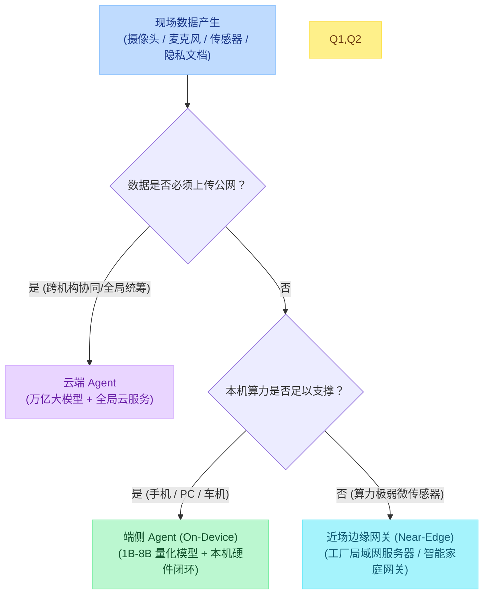
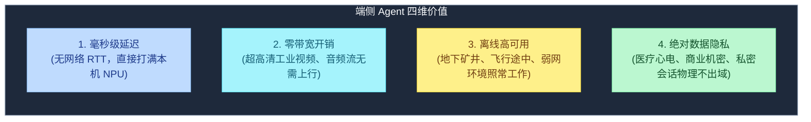
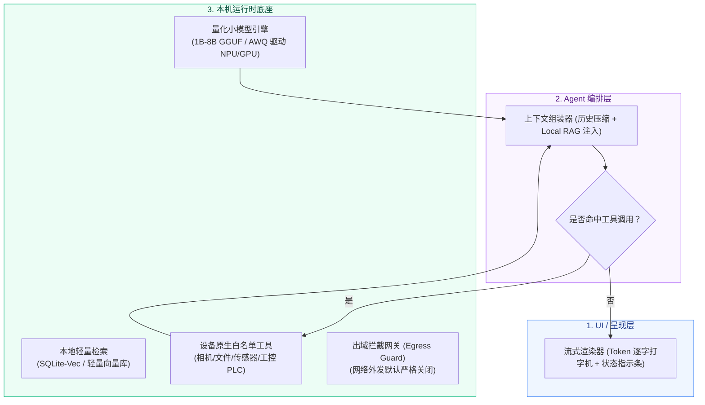
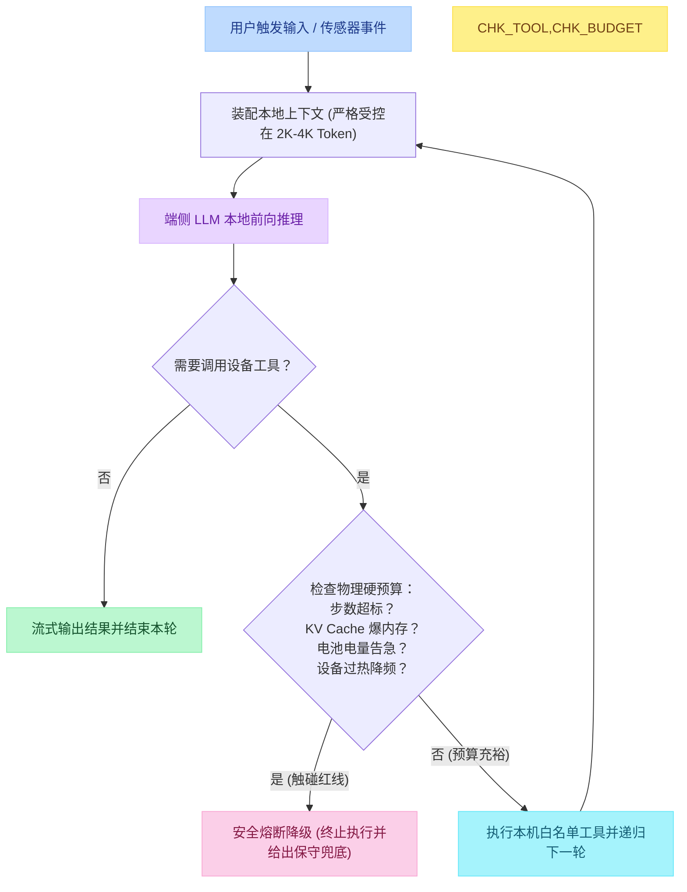
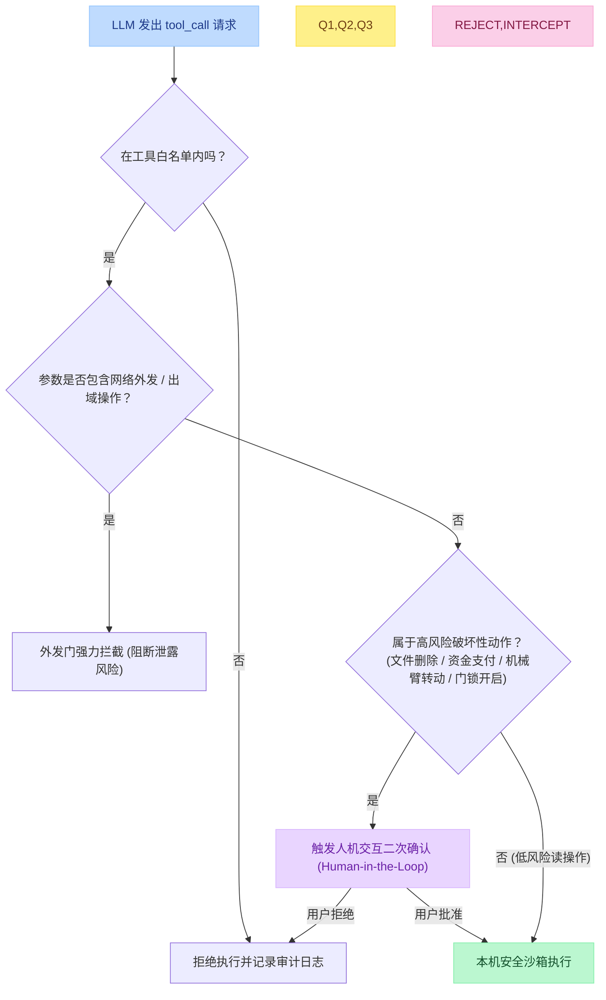
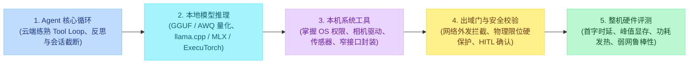

# 14 - 端侧 Agent（On-Device Agent）架构设计与工程落地

## 一、什么是端侧 Agent？

随着手机 NPU、PC 独立算力以及边缘网关芯片的普及，AI 正快速从“云端中枢”向“数据源头的端侧设备”渗透。

端侧 Agent（On-Device Agent）的定义是：**将大语言模型（LLM）、记忆检索（Local RAG）与工具执行闭环全部部署在本机设备上，业务数据默认不出域的自主智能体系统**。

### 与传统形态的两大本质差异：
1. **相比经典 Edge AI（边缘感知）**：传统边缘 AI 仅做单次前向推理（如人脸识别、跌倒检测等单帧 TinyML），没有多步推理、没有状态记忆、无法调用工具链；而端侧 Agent 具备完整的自主决策循环。
2. **相比云端 Agent**：云端 Agent 依赖无限制的显存与带宽，将敏感数据全部打到公网 API；而端侧 Agent 的生成推理、上下文与系统级动作完全在物理设备内部自给自足。

---

## 二、端侧部署的四维核心价值

为什么不把所有事情都丢给云端做？在真实工业与消费级场景中，端侧 Agent 解决了云端无法逾越的四大物理瓶颈：

---

## 三、端侧 Agent 的三层运行时架构

端侧 Agent 绝不是“简单把远程 API URL 改成本地 llama.cpp 端口”。由于设备资源高度受限，必须解耦为严格的三层运行时：

---

## 四、一轮循环与多维资源硬预算

在云端，我们往往只考虑“最大步数（Max Steps）”与“API 花费”；而在端侧，Agent Loop 的运转直接受到设备物理资源的严苛约束：

### 四大物理硬预算指标：
1. **KV Cache 内存墙**：端侧系统必须预留足够的 RAM 给操作系统的其他前台 App。若上下文无限增长导致内存溢出，会被 OS 强行杀进程（OOM Kill）。
2. **热降频（Thermal Throttling）**：移动设备与嵌入式板卡无主动风扇散热，持续打满 NPU 会引发芯片发热降频，导致推理速度从 30 token/s 骤降到 3 token/s。
3. **电量消耗**：穿戴式设备与无人机等电池供电设备对功耗极其敏感，Agent 必须以最少步数迅速收敛。
4. **单批次现实（Batch=1）**：端侧推理无法做高并发 Batching，Prefill 与 Decode 性能必须高度依赖芯片硬件加速优化。

---

## 五、出域安全门与权限防护（Out-of-Domain Guardrail）

在端侧，安全的核心命题不是“模型能否考高分”，而是**“工具绝不能静默破坏系统，敏感数据绝不能被诱导泄露到外网”**。

### 关键工程实现原则：
- **物理定律硬编码**：无人机的最大爬升率、机械臂的活动极限角、阀门的最大开启压力，必须写死在 Tool 层的代码校验逻辑中，**绝不能相信大模型会自觉遵守物理常识**。
- **出域零默认**：系统网络层默认禁用除告警摘要外的所有外部网络请求。即便业务确实需要同步状态，也仅允许上传脱敏后的统计摘要，禁止回传原始视频流和会话上下文。

---

## 六、端侧研发完整技能树与学习路径

端侧 Agent 是典型的“软硬结合全栈系统”，其能力构成要求工程师兼具“模型层、编排层、系统层与硬件层”多重视角：

### 推荐学习路线：
1. **不要一上来死磕手写 CUDA 内核**：先用成熟推理引擎（如 `llama.cpp` 或 Apple `MLX`）在本地 PC 或 Mac 上跑通一个小模型（如 Qwen2.5-1.5B / 7B）。
2. **实现一个本地最小 Loop**：基于本地端口，编写可拦截 `tool_call` 的轻量调度脚本，验证工具执行与多轮状态流转。
3. **添加设备工具与安全护栏**：接入一个本机原生能力（如读取本地特定日志文件或调节系统音量），并加入白名单与网络出域校验。
4. **测试整机指标**：记录 Prefill 耗时、Decode 速度、内存消耗变化，完成端侧全流程验证。

---

## 本篇小结

1. **核心本质**：端侧 Agent 是把“本地量化模型 + 本机短记忆 + 设备白名单工具”闭环在数据发生端，默认物理不出域。
2. **四大优势**：零公网延迟、零网络带宽成本、全离线可用、原生隐私安全。
3. **架构分工**：解耦为 UI 流式呈现、Agent 状态组装、底层轻量运行时三层，保障系统响应度与稳定性。
4. **硬预算控制**：端侧受制于内存墙、发热降频与电池容量，必须具备步数停机、KV Cache 压缩与过载熔断能力。
5. **安全铁律**：网络出域默认关闭，物理安全界限必须硬编码在 Tool 代码层，高风险操作无条件挂起等待用户二次确认。
